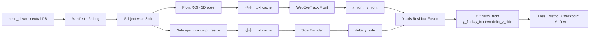

# Dual-view Gaze Pipeline

정면 Webcam과 90° 측면 Phonecam 이미지로 화면 시선 좌표 `(x, y)`를 학습하는
config-driven PyTorch 파이프라인입니다. Front는 WebEyeTrack/BlazeGaze를 사용하고,
Side는 `y`축 residual만 예측합니다.

## 전체 구조



다음 기능이 실행 코드까지 구현되어 있습니다.

- Config 병합·검증, manifest·pairing, subject-wise split
- Front/Side 전처리, Dataset·DataLoader, sample별 `.pkl` cache
- YAML entrypoint 기반 model loader·adapter·pretrained weight
- train/validation/test loop, loss·metric, Y축 fusion
- best/last/final `.pt`, resume, evaluate, MLflow 기록

## 데이터 계약

학습 대상은 각 피험자의 `head_down`, `neutral` session입니다.

```text
<subject>/<session>/
└── feature_maps/
    ├── web/frames/                 # Front 원본
    ├── phone/frames/               # Side 원본
    ├── training.csv
    ├── evaluation.csv
    └── webeyetrack/inputs.csv      # valid, head_vector, face_origin
```

`inputs.csv.valid=0`인 sample은 연결된 Front·Side pair를 함께 제외합니다. Pipeline 내부에서
눈 상태를 다시 계산하지 않습니다. `head_vector [3]`과 `face_origin_3d [3]`도 이 CSV에서 읽습니다.

Side ROI annotation은 별도 CSV로 관리합니다. image-only Side 학습의 필수 열은 다음 네 개입니다.

```csv
sample_id,visible_eye,visible_eye_bbox_xyxy,eye_annotation_valid
s000001,right,"[720,280,980,470]",true
```

`visible_eye_bbox_xyxy`는 각 사람·frame의 실제 눈 bbox입니다. Bbox를 원본 경계 안에서 자른 뒤
바로 `128×256`으로 resize하므로 사람마다 bbox 크기가 달라도 최종 shape은 같고 검은 padding은
생기지 않습니다.

눈꺼풀 6점, iris, Side head anchor가 있으면 아래 선택형 feature도 같은 CSV에 추가할 수 있습니다.
자세한 열과 pairing 규칙은 [데이터 형식](docs/dataset-format.md)을 참고하세요.

현재 DB의 `head_down`·`neutral`에는 810 pair가 있고 `inputs.csv.valid=1`로 승인된 pair는
809개입니다. 현재 preview용 Side bbox는 2개뿐이므로 전체 학습은 나머지 807개의 검수된 bbox를
추가한 뒤 가능합니다. `measured-manifest`와 `measured-train`은 누락 annotation이 있으면 의도적으로
중단하며 더미 bbox로 계속 학습하지 않습니다.

## 설치와 검사

Python 3.12를 사용합니다.

```bash
make paths
make setup-dev
make check
make webeyetrack-assets
```

외부 데이터와 weight 없이 전체 train/fusion/checkpoint/MLflow 연결을 확인하려면:

```bash
make demo-dual-train
```

## 최종 학습 순서

아래 경로는 기본값입니다.

```text
MEASURED_DATA_ROOT = ../project_data/data
SIDE_ANNOTATIONS   = ../project_data/data/side_annotations.csv
```

1. manifest, pairing, split을 검사합니다.

```bash
make measured-manifest \
  SIDE_ANNOTATIONS="/absolute/path/to/side_annotations.csv"

make measured-prepare \
  SIDE_ANNOTATIONS="/absolute/path/to/side_annotations.csv"
```

피험자 단위로 무작위 분할하며 기본 비율은 `70/15/15`, seed는 `42`입니다. 피험자가 5명이면
한 사람을 나누지 않기 때문에 실제 배정은 `3/1/1`, 즉 `60/20/20`이 됩니다.

2. 실제 전처리를 그림으로 확인합니다.

```bash
make measured-preview \
  SIDE_ANNOTATIONS="/absolute/path/to/side_annotations.csv"
```

결과는 `outputs/measured_preprocessing_preview/`에 생성됩니다. 기존에 저장된 Front/Side ROI는
읽지 않고 corrected frame에서 다시 만듭니다.

3. Side 모델 하나를 골라 학습합니다.

```bash
make measured-train \
  SIDE_ANNOTATIONS="/absolute/path/to/side_annotations.csv" \
  SIDE_MODEL_PROFILE="configs/models/side_mobilenet_v4.yaml" \
  OVERRIDES="training.max_epochs=100 data.dataloader.batch_size=8"
```

BlazeGaze-transfer Side Encoder를 쓰려면 model profile만 바꿉니다.

```bash
make measured-train \
  SIDE_ANNOTATIONS="/absolute/path/to/side_annotations.csv" \
  SIDE_MODEL_PROFILE="configs/models/side_blazegaze_transfer.yaml"
```

4. 같은 model profile로 결과를 평가하고 MLflow UI를 엽니다.

```bash
make measured-evaluate \
  CHECKPOINT="/absolute/path/to/best_weights.pt" \
  EVAL_SPLIT=test \
  SIDE_MODEL_PROFILE="configs/models/side_mobilenet_v4.yaml"

make measured-mlflow-ui
```

브라우저에서 `http://127.0.0.1:5000`을 열면 epoch loss, metric, config, checkpoint를 볼 수 있습니다.

## Config 조합

Production 순서는 다음과 같습니다. 모델 profile은 반드시 마지막에 둡니다.

```text
configs/config.yaml
  → configs/profiles/blazegaze.yaml
  → configs/profiles/side_profile_90.yaml
  → configs/profiles/side_roi_only.yaml
  → configs/profiles/measured_head_down_neutral.yaml
  → configs/models/front_webeyetrack.yaml
  → configs/models/<선택한-side-model>.yaml
  → CLI override
```

### 모델 교체

내장 모델은 `SIDE_MODEL_PROFILE`만 바꾸면 됩니다. 외부 PyTorch 모델은 YAML에서 factory와
adapter를 지정합니다.

```yaml
model:
  side:
    source_dir: /absolute/path/to/model-repository
    entrypoint: my_models.side:create_model
    adapter_entrypoint: my_models.side:create_adapter
    init_args:
      embedding_dim: 256
    pretrained:
      path: /absolute/path/to/weights.pt
      sha256: <64-hex>
      strict: true
```

Factory는 `init_args`로 모델을 만들고 adapter는 canonical batch를 모델 인자로 바꾼 뒤 출력을
`delta_y_side [B,1]`로 표준화합니다. 상세 계약은 [Side Encoder](docs/side-encoders.md)에 있습니다.

### Side 입력 선택

`side_image [B,3,128,256]`은 항상 들어갑니다. 추가 feature는 각각 켜고 끌 수 있습니다.

```yaml
preprocessing:
  branch_overrides:
    side:
      eye_region_warp:
        feature_extraction:
          side_headpose:
            enabled: false
            source: side_2d       # 또는 paired Front의 front_3d
          side_eyeangle:
            enabled: false        # a0→a1, a0→a2 방향각 [B,2]
          side_eyelidangle:
            enabled: false        # iris 상대 위치 [B,2]
            vertical_only: true
```

`forward_keys: auto`가 활성 feature만 Side 모델에 전달합니다. 해당 annotation 없이 feature를
`true`로 켜면 sample이 무효 처리되므로 image-only 학습은 모두 `false`로 둡니다.

### Loss 변경

지원 loss는 `huber_xy`, `mse_xy`, `weighted_l2_xy`입니다.

```bash
# Huber
make measured-train OVERRIDES="loss.primary.name=huber_xy loss.primary.delta=0.05"

# MSE
make measured-train OVERRIDES="loss.primary.name=mse_xy"

# 화면 위치 빈도 보정 L2
make measured-train \
  OVERRIDES="loss.primary.name=weighted_l2_xy loss.primary.frequency_grid_size=[30,30]"
```

Side residual을 별도 loss로 더 강하게 학습하려면:

```yaml
loss:
  branch_auxiliary:
    enabled: true
    front_weight: 0.0
    side_weight: 1.0
```

### Metric 변경

시선 추정은 회귀 문제이므로 일반 분류 accuracy 대신 MAE, RMSE, Euclidean error를 사용합니다.
`metrics.report`로 기록할 지표를 고르고 `selection_metric`으로 best checkpoint 기준을 정합니다.

```yaml
metrics:
  selection_metric: subject_macro_euclidean_normalized
  fallback_selection_metric: euclidean_normalized_mean
  report:
    - euclidean_normalized_mean
    - mae_x_normalized
    - mae_y_normalized
    - rmse_normalized
    - within_0_05_normalized_rate
  threshold_rates:
    - name: within_0_05_normalized_rate
      unit: normalized
      threshold: 0.05
      enabled: true
```

`within_0_05_normalized_rate`는 정답과의 거리가 `0.05` 이내인 비율로, 회귀에서 사용할 수 있는
threshold accuracy입니다. `unit`은 `normalized`, `pixel`, `cm`을 지원하지만 pixel/cm 지표에는
각 화면의 픽셀/실제 크기 정보가 필요합니다.

### 전처리 `.pkl` cache

측정 DB profile은 cache가 기본 활성화되어 있습니다.

```yaml
preprocessing:
  cache:
    enabled: true
    dir: "${paths.output_root}/preprocessed_cache"
    mode: read_write   # read_write | read_only | refresh
    format: pickle
    trusted_local: true
```

첫 학습에서 sample별 `.pkl`을 만들고 다음 학습부터 재사용합니다. 다음 항목이 하나라도 바뀌면
새 cache key가 생성됩니다.

- resolved preprocessing Config와 augmentation 경계·옵션
- manifest row와 Side bbox/선택 feature
- Front/Side view
- train/validation/test split
- 원본 이미지 bytes의 SHA-256
- cache schema와 preprocessing implementation ID

augmentation은 pickle에 저장하지 않고 매 epoch cache를 읽은 뒤 다시 적용합니다. Pickle은 임의
코드를 실행할 수 있으므로 이 cache를 공유·다운로드하지 말고 pipeline이 만든 로컬 폴더에서만
사용하세요. 전부 다시 만들려면 `preprocessing.cache.mode=refresh`를 한 번 사용합니다.
같은 cache 폴더에 대해 여러 process가 동시에 `refresh`를 실행하지 마세요.

## 모델 입출력

| Branch | 입력 | 출력 |
|---|---|---|
| Front | `front_image [B,3,128,512]`, `front_head_vector [B,3]`, `front_face_origin_3d [B,3]` | `gaze_xy [B,2]` |
| Side | `side_image [B,3,128,256]` + 선택 feature | `delta_y_side [B,1]`, `side_embedding`, optional `quality` |
| Fusion | Front `(x,y)` + Side `delta_y` | 최종 `gaze_xy [B,2]` |

좌표는 화면 중심 기준 `[-0.5,0.5]`이며 음수 좌표가 필요하므로 출력에 ReLU를 사용하지 않습니다.
현재 `quality`에는 별도 target/loss가 없어 head가 학습되지 않으므로 결과 품질 지표로 사용하지
않습니다.

## 결과 위치

```text
outputs/<experiment>/<run>/
├── resolved_config.yaml
├── manifests/
├── checkpoints/best_weights.pt
├── checkpoints/last_checkpoint.pt
├── models/final_weights.pt
├── metrics/
└── predictions/

<output_root>/preprocessed_cache/   # gitignore된 local .pkl shards
mlflow.db
```

모델·checkpoint는 `.pt`, 전처리 cache만 `.pkl`을 사용합니다. 원본 얼굴 이미지와 피험자 ID가 든
prediction은 기본적으로 MLflow artifact에 올리지 않습니다.

상세 설명: [아키텍처](docs/architecture.md) · [Configuration](docs/configuration.md) ·
[데이터 형식](docs/dataset-format.md) · [기여 가이드](CONTRIBUTING.md)
