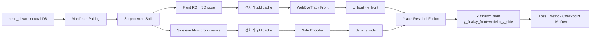

# Dual-view Gaze Pipeline

정면 Webcam과 90° 측면 Phonecam 이미지로 화면 시선 좌표 `(x, y)`를 학습하는
config-driven PyTorch 파이프라인입니다. Front는 WebEyeTrack/BlazeGaze를 사용하고,
Side는 `y`축 residual만 예측합니다.

## 핵심 요약

| 항목 | 현재 기준 |
|---|---|
| Task | 화면 중심 기준 2D 시선 좌표 회귀 |
| 좌표계 | `x,y ∈ [-0.5, 0.5]`, 오른쪽·아래쪽이 양수 |
| Front | WebEyeTrack BlazeGaze, 사전 생성된 `128×512` 양안 ROI |
| Side | `128×128` ROI를 `128×256` 검정 canvas 중앙에 배치 |
| Fusion | `x_final=x_front`, `y_final=y_front+w·delta_y_side` |
| Split | `subject_id` 기준 `70/15/15`, seed `42` |
| 추적 | MLflow에 config·epoch metric·checkpoint·환경·lineage 기록 |

원본 얼굴 이미지, 피험자 식별자가 포함된 manifest, 모델 weight, 전처리 cache와 MLflow DB는
Git에 포함하지 않습니다. 저장소에는 파이프라인 코드·설정·문서·테스트만 보관합니다.

## 전체 구조



다음 기능이 실행 코드까지 구현되어 있습니다.

- Config 병합·검증, manifest·pairing, subject-wise split
- Front/Side 전처리, Dataset·DataLoader, sample별 `.pkl` cache
- YAML entrypoint 기반 model loader·adapter·pretrained weight
- train/validation/test loop, loss·metric, Y축 fusion
- best/last/final `.pt`, resume, evaluate, MLflow 기록

## 모델 구성

| Branch | 구현과 초기화 | 입력 | 출력 |
|---|---|---|---|
| Front | 공식 WebEyeTrack BlazeGaze `.keras`; encoder 고정, gaze MLP 학습 | `front_image [B,3,128,512]`, `front_head_vector [B,3]`, `front_face_origin_3d [B,3]` | `gaze_xy [B,2]` |
| Side / BlazeGaze | WebEyeTrack commit `14719ad`의 CNN encoder 구조 재현; 기본값은 random init, 변환된 encoder `.pt` 선택 가능 | `side_image [B,3,128,256]` + 선택 feature | `delta_y_side [B,1]`, `side_embedding [B,256]`, `quality [B,1]` |
| Side / MobileNetV4 | `mobilenetv4_conv_small.e2400_r224_in1k`; 기본값 `pretrained=false` | 위와 동일 | 위와 동일 |
| Fusion | 학습 가능한 Y축 residual weight | Front `(x,y)` + Side `delta_y_side` | 최종 `gaze_xy [B,2]` |

Front weight는 `configs/models/front_webeyetrack.yaml`의 SHA-256으로 검증합니다. 기본
`unfreeze_encoder=false`에서는 전체 156,018개 parameter 중 gaze head 8,610개만 학습합니다.
Side model은 실행 시 `SIDE_MODEL_PROFILE`로 BlazeGaze-transfer와 MobileNetV4 중 하나를 선택합니다.

좌표에 음수가 필요하므로 최종 출력에는 ReLU를 사용하지 않습니다. `quality` head는 현재 별도
target/loss가 없어 학습 품질 지표로 사용하지 않습니다.

## 데이터 계약

학습 대상은 각 피험자의 `head_down`, `neutral` session입니다.

```text
Participants/
└── <subject>/<session>/
    └── feature_maps/
        ├── web/frames/                 # Front 원본
        ├── phone/frames/               # Side 원본
        ├── training.csv
        ├── evaluation.csv
        └── webeyetrack/inputs.csv      # valid, head_vector, face_origin
```

`inputs.csv.valid`를 눈 상태의 최종 기준으로 사용합니다. 정확히 `1`이면 눈 뜸(open)으로 사용하고,
`0`이면 눈 감음(close)으로 판단해 연결된 Front·Side pair를 함께 제외합니다. Pipeline 내부에서
눈 상태를 다시 계산하지 않습니다. `head_vector [3]`과 `face_origin_3d [3]`도 이 CSV에서 읽습니다.

현재 기본 측정 데이터는 Front와 Side 모두 이미 만들어진 ROI를 직접 사용합니다.

```text
process_data/
└── <subject>/<head_down|neutral>/
    ├── eye_roi/<pair_id>.png                 # Front 128x512
    ├── side_eye_roi/<원래-phone-frame>.png   # Side 128x128
    └── inputs.csv
```

ROI는 `128×128`을 기준으로 처리합니다. 한 픽셀이라도 크면 중앙 crop하고, 작으면 검정색으로
중앙 padding합니다. 이 과정에는 resize/interpolation이 없습니다. 완성된 `128×128` ROI는
`128×256` 검정 canvas의 중앙 `x=64:192`에 배치하고 `[0,1]` float32로 정규화합니다.

`eye_roi`는 기존 `Participants/.../webeyetrack/eye_roi`와 전 파일 hash/pixel 비교 후 그대로
`128×512` 모델 입력으로 사용합니다. `side_eye_roi`는 `128×256` 검정 canvas 중앙에 배치합니다.
`inputs.csv`가 없는 session, `valid=0`, ROI 누락 pair와 품질 검수에서 제외된 session은 학습하지
않습니다.

## 설치와 검사

Python 3.12를 사용합니다.

```bash
make paths
make setup-dev
make check
make webeyetrack-assets
```

Windows에서 `make`와 Conda가 없다면 PowerShell용 설치 스크립트를 사용합니다. 먼저 Python 3.12를
설치하고 그 `python.exe` 경로를 지정합니다.

```powershell
powershell -ExecutionPolicy Bypass -File scripts\setup_windows.ps1 `
  -PythonPath "C:\path\to\Python312\python.exe" -Dev
```

외부 데이터와 weight 없이 전체 train/fusion/checkpoint/MLflow 연결을 확인하려면:

```bash
make demo-dual-train
```

## 실시간 시연: 마우스 목표점과 시선 원

`demo` 명령은 정면 웹캠과 90° 측면 폰카메라를 동시에 읽어 83.1% pairwise 모델을 실행합니다.
시연 화면에서 청록색 십자 `MOUSE TARGET`은 마우스 위치, 빨간 원 `EYE GAZE`는 모델이 예측한
시선 위치입니다. 학습 사진, manifest와 MLflow DB는 시연 PC에 복사할 필요가 없습니다.

### 이 컴퓨터에서 이동용 모델 ZIP 만들기

모델 파일은 `.gitignore` 대상이므로 Git에 포함되지 않습니다. 다음 명령은 검증된 체크포인트의
SHA-256을 확인한 뒤 현재 실행용 `models/demo`와 이동용 `release/live-demo-models.zip`을 만듭니다.

```powershell
.venv\Scripts\python.exe scripts\build_live_demo_bundle.py
```

`live-demo-models.zip`에는 다음 파일만 들어갑니다.

- 83.1% pairwise pipeline checkpoint
- 공식 BlazeGaze Front 기본 모델
- 정면/측면 얼굴 검출용 MediaPipe 모델
- 측면 90° 얼굴 fallback용 YuNet 모델
- 파일별 SHA-256 manifest

### 다른 Windows 컴퓨터에서 실행하기

1. 다른 컴퓨터에 **64-bit Python 3.12**와 Git을 설치합니다.
2. 코드를 clone합니다.

   ```powershell
   git clone https://github.com/ggulNote/eye-tracking-ml.git
   cd eye-tracking-ml
   ```

3. 이 컴퓨터에서 만든 `live-demo-models.zip`을 저장소 최상위 폴더에 복사합니다.
4. ZIP을 풀었을 때 `models\demo\best_weights.pt`가 되도록 압축을 해제합니다. ZIP 안에 이미
   `models/demo` 폴더가 들어 있으므로 저장소 최상위에서 그대로 풀면 됩니다.
5. 인터넷이 연결된 상태에서 환경 설치 파일을 한 번 실행합니다.

   ```powershell
   .\setup_demo_windows.bat
   ```

6. 카메라를 열지 않고 모델 파일·체크포인트·CPU 로딩을 먼저 확인합니다.

   ```powershell
   .\verify_demo_windows.bat
   ```

7. 정면 웹캠과 측면 폰카메라를 연결한 뒤 시연을 실행합니다.

   ```powershell
   .\run_demo_windows.bat
   ```

Windows에서 폰카메라가 일반 웹캠 장치로 보여야 합니다. DroidCam, Camo 같은 virtual webcam을
사용하거나 OpenCV가 읽을 수 있는 RTSP 주소를 `--side-camera`에 전달할 수 있습니다. 카메라 번호가
다르면 다음처럼 지정합니다.

```powershell
.venv\Scripts\python.exe -m gaze_pipeline demo `
  --front-camera 1 --side-camera 2 --show-cameras
```

폰 영상이 세로 또는 뒤집힌 방향이면 `--side-rotate 90`, `180`, `270`을 추가합니다. 거울처럼
반전된 장치는 `--mirror-front` 또는 `--mirror-side`를 사용합니다. GPU가 없는 PC는 자동으로 CPU를
사용하며 속도만 느려질 수 있습니다.

### 다른 macOS 컴퓨터에서 실행하기

현재 고정된 재현 환경은 **Apple Silicon(M1 이상), macOS 14 Sonoma 이상, native arm64 Python
3.12**를 대상으로 합니다. PyTorch `MPS`를 자동으로 선택하며 MPS를 쓸 수 없으면 CPU를 사용합니다.
Intel Mac은 현재 고정 버전과 다른 legacy dependency 검증이 필요하므로 이 설치 스크립트가 중단하고
명확한 안내를 출력합니다.

1. Mac에 **64-bit Python 3.12**와 Git을 설치합니다. Homebrew를 사용한다면 다음과 같습니다.

   ```bash
   brew install python@3.12 git
   ```

2. 저장소를 clone합니다.

   ```bash
   git clone https://github.com/ggulNote/eye-tracking-ml.git
   cd eye-tracking-ml
   ```

3. `live-demo-models.zip`을 저장소 최상위 폴더로 옮기고 압축을 풉니다.

   ```bash
   unzip live-demo-models.zip -d .
   test -f models/demo/best_weights.pt && echo "model assets OK"
   ```

4. macOS 실행 파일 권한을 확인하고 전용 환경을 설치합니다. 최초 설치에는 인터넷 연결이
   필요합니다.

   ```bash
   chmod +x setup_demo_macos.sh verify_demo_macos.sh run_demo_macos.sh
   ./setup_demo_macos.sh
   ```

5. 카메라를 열지 않고 모델 asset, checkpoint와 전체 smoke inference를 검사합니다.

   ```bash
   ./verify_demo_macos.sh
   ```

6. Mac 내장 카메라를 정면에 두고, iPhone/외부 카메라를 얼굴의 90° 측면에 둔 뒤 실행합니다.

   ```bash
   ./run_demo_macos.sh
   ```

첫 실행 때 macOS가 카메라 접근을 물으면 허용합니다. 영상이 나오지 않으면 **시스템 설정 →
개인정보 보호 및 보안 → 카메라**에서 Terminal 또는 사용하는 터미널 앱을 켠 뒤 터미널을 다시
실행합니다. iPhone은 Continuity Camera 또는 Camo 같은 virtual webcam으로 Mac의 카메라 장치에
나타나야 합니다.

장치 번호가 반대로 잡혔거나 측면 영상이 회전된 경우 실행 인자를 덮어씁니다.

```bash
./run_demo_macos.sh --front-camera 1 --side-camera 0 --side-rotate 90
```

Apple Silicon MPS에서 환경별 연산 문제가 발생하면 CPU로 전환할 수 있습니다.

```bash
./verify_demo_macos.sh --device cpu
./run_demo_macos.sh --device cpu
```

시연 조작키는 다음과 같습니다.

| 입력 | 동작 |
|---|---|
| 마우스 이동 | 보고자 하는 목표점 이동 |
| `Space` | 현재 마우스 목표점과 최근 시선 예측으로 보정 표본 추가 |
| `C` | 보정 초기화 |
| `R` | 시선 원 smoothing 초기화 |
| `V` | 두 카메라 미리보기 표시/숨김 |
| `Q` 또는 `Esc` | 종료 |

보정은 화면의 좌상·우상·좌하·우하·중앙처럼 서로 일직선이 아닌 지점을 보면서 각 지점에서
`Space`를 누릅니다. 최소 3점부터 affine 보정이 적용되며 5~9점을 권장합니다. Pairwise test는
학습에 참여한 11명의 다른 촬영 pair를 평가한 결과이므로, 새로운 사람이나 카메라 위치·조명이 크게
달라진 환경에서는 83.1%가 그대로 재현된다는 의미가 아닙니다.

## 전체 학습 파이프라인

### 1. 데이터 감사와 manifest 생성

주 학습 경로는 `process_data/<subject>/<session>/{eye_roi,side_eye_roi,inputs.csv}`입니다. Windows에서는
다음 스크립트가 전수 이미지 감사, `valid`/pair 검증, quality exclusion 적용, manifest 생성과
subject-wise split 준비를 순서대로 실행합니다.

```powershell
powershell -ExecutionPolicy Bypass -File scripts\run_process_data_windows.ps1 `
  -ProcessDataRoot "C:\path\to\process_data" `
  -ReferenceRoot "C:\path\to\Participants"
```

경로 인자를 생략하면 프로젝트의 상위 폴더에서 `process_data`와 `Participants`를 찾습니다.
`-SkipPrepare`는 감사·manifest·config 검증까지만 다시 실행합니다. 준비 결과는 기본적으로
`.demo/process_data_audit`에 저장되며 Git에는 포함되지 않습니다.

Manifest 단계에서 다음 sample을 제외합니다.

- `inputs.csv.valid != 1`
- Front/Side 중 하나가 없거나 target·subject가 일치하지 않는 pair
- ROI 파일이 없거나 허용 shape를 만족하지 않는 sample
- 품질 검수에서 제외된 session

Split은 `subject_id`를 기준으로 `70/15/15`, seed `42`를 사용하여 같은 사람이 여러 split에
섞이지 않게 합니다. 피험자가 5명이면 사람 단위를 보존하므로 실제 배정은 `3/1/1`입니다.

### 2. Config 병합과 전처리

Base config 위에 데이터·전처리·모델 profile을 순서대로 병합하고, CLI override를 마지막에
적용합니다. 정확한 병합 순서는 아래 [설정 조합과 실험 변경](#설정-조합과-실험-변경)에 있습니다.

Front ROI는 `128×512` 그대로 사용합니다. Side ROI는 중앙 crop/padding으로 `128×128`을 만든 뒤
`128×256` 검정 canvas 중앙에 배치합니다. Train split에만 좌우 반전과 color jitter를 적용하며,
결정적 전처리 결과는 sample별 `.pkl` cache로 재사용할 수 있습니다.

### 3. 모델 학습

`process_data` profile의 기본 학습 조건은 다음과 같습니다.

| 항목 | 값 |
|---|---|
| 최대 epoch | `50` |
| Early stopping | validation 10회 연속 미개선, `min_delta=0.0005` |
| Batch size | `8` |
| Optimizer | AdamW, `lr=1e-4`, `weight_decay=1e-4` |
| Scheduler | ReduceLROnPlateau, factor `0.5`, patience `3`, min LR `1e-6` |
| Primary loss | Huber (`delta=0.05`), axis weight `x=1`, `y=2` |
| Auxiliary loss | 3×3 grid boundary loss `0.5`; dual-view Side residual loss `1.0` |
| Best 기준 | `val/subject_macro_same_cell_rate_3x3`, mode `max` |
| 재현성 | seed `42`, deterministic mode |

PowerShell에서 `process_data`를 직접 학습하는 예시는 다음과 같습니다. 마지막 profile만 바꾸면
Side encoder를 교체할 수 있습니다.

```powershell
$env:PROCESS_DATA_ROOT = "C:\path\to\process_data"
$env:PROCESS_DATA_MANIFEST = ".demo\process_data_audit\manifest.csv"
$env:GAZE_OUTPUT_ROOT = ".demo\process_data_training\outputs"
$env:MLFLOW_TRACKING_URI = "sqlite:///./.demo/process_data_training/mlflow.db"

$profiles = @(
  "configs/profiles/blazegaze.yaml",
  "configs/profiles/front_precomputed_eye_roi.yaml",
  "configs/profiles/side_profile_90.yaml",
  "configs/profiles/side_precomputed_roi.yaml",
  "configs/profiles/process_data.yaml",
  "configs/models/front_webeyetrack.yaml",
  "configs/models/side_blazegaze_transfer.yaml"
)
$profileArgs = foreach ($profile in $profiles) { "--profile"; $profile }

& .venv\Scripts\python.exe -m gaze_pipeline train `
  --config configs/config.yaml @profileArgs
```

MobileNetV4를 사용하려면 마지막 항목을 `configs/models/side_mobilenet_v4.yaml`로 교체합니다.
Front-only 통제군은 모든 Side profile 뒤에
`configs/profiles/process_data_subjectwise_front_only.yaml`을 추가합니다.

기존 `Participants + 외부 Side ROI` 데이터 구조는 다음 wrapper로 재현할 수 있습니다.

```powershell
powershell -ExecutionPolicy Bypass -File scripts\run_precomputed_side_roi_windows.ps1
```

```bash
make measured-train \
  SIDE_MODEL_PROFILE="configs/models/side_blazegaze_transfer.yaml" \
  OVERRIDES="training.max_epochs=50 data.dataloader.batch_size=8"
```

### 4. Checkpoint, 평가와 MLflow

각 epoch에서 validation metric을 기록하고 best checkpoint를 갱신합니다. `best_weights.pt`는
평가용 weight만, `last_checkpoint.pt`는 optimizer·scheduler·RNG 상태까지 포함하여 재개에
사용합니다. 학습 종료 시 `final_weights.pt`와 최종 validation summary를 저장합니다.

```powershell
& .venv\Scripts\python.exe -m gaze_pipeline evaluate `
  --config configs/config.yaml @profileArgs `
  --checkpoint "C:\path\to\best_weights.pt" --split test

& .venv\Scripts\mlflow.exe ui `
  --backend-store-uri $env:MLFLOW_TRACKING_URI --port 5000
```

브라우저에서 `http://127.0.0.1:5000`을 열면 epoch loss, metric, resolved config, 환경 정보,
checkpoint SHA-256과 artifact를 확인할 수 있습니다. 이 주소는 로컬 UI이므로 외부 공유 링크가
아닙니다.

## 검증된 학습 이력

2026-08-25까지 로컬 MLflow에서 `FINISHED` 상태와 checkpoint lineage를 확인한 실행입니다.
학습 데이터·weight·MLflow DB 자체는 개인정보와 용량 문제로 Git에 포함하지 않고 run ID와
요약만 기록합니다.

실시간 시연에 사용하는 pairwise 실행은 train/test에 동일한 11명의 서로 다른 pair가 포함됩니다.
Best checkpoint SHA-256은
`127ca3014d9ef27cdabc327b0145e2c66a1741642bb278fb41a432156a24225f`입니다.

| 모델 | Train run ID | Best epoch | Validation 3×3 | Test run ID | Test 3×3 |
|---|---|---:|---:|---|---:|
| Pairwise Dual-view + BlazeGaze Side | `8fcf7781bf534120befe6f385f4ee386` | `45` | `83.92%` | `579b79b77cc145fba234f53fa685306b` | `83.14%` |

| 모델 | Lineage | Train run ID | 완료/best epoch | Best val macro 3×3 | Test run ID |
|---|---:|---|---:|---:|---|
| Dual-view + BlazeGaze Side | A | `ddaaca78ad554d5b9a7b60fc499a20c1` | `16 / 6` | `53.03%` | `e100fcfe75e24155a17f9e277f23a28f` |
| Dual-view + MobileNetV4 Side | B | `7664d32974a84cbaaf08ceba6aaf9a90` | `13 / 3` | `53.48%` | `1d15fd15c07e419ca86fcd83f627e4b9` |
| BlazeGaze Front-only | A | `fd43712a9596469983c2cdf92c5ba9d1` | `19 / 9` | `52.53%` | `47fa8f5eaf8649139fa39f35a05a7b6c` |

| 모델 | Test mean Euclidean ↓ | Test macro 3×3 ↑ | `within 0.05` ↑ | Out of bounds ↓ |
|---|---:|---:|---:|---:|
| Dual-view + BlazeGaze Side | `0.1863` | `56.56%` | `9.67%` | `0.47%` |
| Dual-view + MobileNetV4 Side | `0.2007` | `51.12%` | `7.64%` | `0.62%` |
| BlazeGaze Front-only | `0.2269` | `46.21%` | `7.80%` | `4.99%` |

Lineage A의 BlazeGaze Side와 Front-only는 동일한 dataset/split/test hash를 사용하므로 통제 비교가
가능하며, Side branch가 모든 주요 test 지표를 개선했습니다. MobileNetV4 실행은 다른 dataset
revision(Lineage B)을 사용했으므로 수치를 직접 우열 비교하기보다 참고 결과로 봐야 합니다.

## 설정 조합과 실험 변경

`process_data` 주 학습 순서는 다음과 같습니다. 모델 profile은 반드시 데이터·전처리 profile 뒤에
두고, 통제군/ablation profile은 모델 뒤에 둡니다.

```text
configs/config.yaml
  → configs/profiles/blazegaze.yaml
  → configs/profiles/front_precomputed_eye_roi.yaml
  → configs/profiles/side_profile_90.yaml
  → configs/profiles/side_precomputed_roi.yaml
  → configs/profiles/process_data.yaml
  → configs/models/front_webeyetrack.yaml
  → configs/models/<선택한-side-model>.yaml
  → configs/profiles/<선택한-ablation>.yaml
  → CLI override
```

`Participants + 외부 Side ROI` 형식에서는 `front_precomputed_eye_roi.yaml`과 `process_data.yaml` 대신
`measured_head_down_neutral.yaml`을 사용합니다. 최종 resolved config는 실행 폴더와 MLflow artifact에
함께 기록됩니다.

### 모델 교체

내장 모델은 `SIDE_MODEL_PROFILE`만 바꾸면 됩니다. 외부 PyTorch 모델은 YAML에서 factory와
adapter를 지정합니다.

```yaml
model:
  side:
    source_dir: /absolute/path/to/model-repository
    entrypoint: my_models.side:create_model
    adapter_entrypoint: my_models.side:create_adapter
    init_args:
      embedding_dim: 256
    pretrained:
      path: /absolute/path/to/weights.pt
      sha256: <64-hex>
      strict: true
```

Factory는 `init_args`로 모델을 만들고 adapter는 canonical batch를 모델 인자로 바꾼 뒤 출력을
`delta_y_side [B,1]`로 표준화합니다. 상세 계약은 [Side Encoder](docs/side-encoders.md)에 있습니다.

### Side 입력 선택

`side_image [B,3,128,256]`은 항상 들어갑니다. 추가 feature는 각각 켜고 끌 수 있습니다.

```yaml
preprocessing:
  branch_overrides:
    side:
      eye_region_warp:
        feature_extraction:
          side_headpose:
            enabled: false
            source: side_2d       # 또는 paired Front의 front_3d
          side_eyeangle:
            enabled: false        # a0→a1, a0→a2 방향각 [B,2]
          side_eyelidangle:
            enabled: false        # iris 상대 위치 [B,2]
            vertical_only: true
```

`forward_keys: auto`가 활성 feature만 Side 모델에 전달합니다. 해당 annotation 없이 feature를
`true`로 켜면 sample이 무효 처리되므로 image-only 학습은 모두 `false`로 둡니다.

### Loss 변경

지원 loss는 `huber_xy`, `mse_xy`, `weighted_l2_xy`입니다.

```bash
# Huber
make measured-train OVERRIDES="loss.primary.name=huber_xy loss.primary.delta=0.05"

# MSE
make measured-train OVERRIDES="loss.primary.name=mse_xy"

# 화면 위치 빈도 보정 L2
make measured-train \
  OVERRIDES="loss.primary.name=weighted_l2_xy loss.primary.frequency_grid_size=[30,30]"
```

Side residual을 별도 loss로 더 강하게 학습하려면:

```yaml
loss:
  branch_auxiliary:
    enabled: true
    front_weight: 0.0
    side_weight: 1.0
```

### Metric 변경

시선 추정은 회귀 문제이므로 일반 분류 accuracy 대신 MAE, RMSE, Euclidean error를 사용합니다.
`metrics.report`로 기록할 지표를 고르고 `selection_metric`으로 best checkpoint 기준을 정합니다.

```yaml
metrics:
  selection_metric: subject_macro_euclidean_normalized
  fallback_selection_metric: euclidean_normalized_mean
  report:
    - euclidean_normalized_mean
    - mae_x_normalized
    - mae_y_normalized
    - rmse_normalized
    - within_0_05_normalized_rate
  threshold_rates:
    - name: within_0_05_normalized_rate
      unit: normalized
      threshold: 0.05
      enabled: true
```

`within_0_05_normalized_rate`는 정답과의 거리가 `0.05` 이내인 비율로, 회귀에서 사용할 수 있는
threshold accuracy입니다. `unit`은 `normalized`, `pixel`, `cm`을 지원하지만 pixel/cm 지표에는
각 화면의 픽셀/실제 크기 정보가 필요합니다.

### 전처리 `.pkl` cache

측정 DB profile은 cache가 기본 활성화되어 있습니다.

```yaml
preprocessing:
  cache:
    enabled: true
    dir: "${paths.output_root}/preprocessed_cache"
    mode: read_write   # read_write | read_only | refresh
    format: pickle
    trusted_local: true
```

첫 학습에서 sample별 `.pkl`을 만들고 다음 학습부터 재사용합니다. 다음 항목이 하나라도 바뀌면
새 cache key가 생성됩니다.

- resolved preprocessing Config와 augmentation 경계·옵션
- manifest row와 Side bbox/선택 feature
- Front/Side view
- train/validation/test split
- 원본 이미지 bytes의 SHA-256
- cache schema와 preprocessing implementation ID

augmentation은 pickle에 저장하지 않고 매 epoch cache를 읽은 뒤 다시 적용합니다. Pickle은 임의
코드를 실행할 수 있으므로 이 cache를 공유·다운로드하지 말고 pipeline이 만든 로컬 폴더에서만
사용하세요. 전부 다시 만들려면 `preprocessing.cache.mode=refresh`를 한 번 사용합니다.
같은 cache 폴더에 대해 여러 process가 동시에 `refresh`를 실행하지 마세요.

## 결과 위치

```text
outputs/<experiment>/<run>/
├── resolved_config.yaml
├── manifests/
├── checkpoints/best_weights.pt
├── checkpoints/last_checkpoint.pt
├── models/final_weights.pt
├── metrics/
└── predictions/

<output_root>/preprocessed_cache/   # gitignore된 local .pkl shards
mlflow.db
```

모델·checkpoint는 `.pt`, 전처리 cache만 `.pkl`을 사용합니다. 원본 얼굴 이미지와 피험자 ID가 든
prediction은 기본적으로 MLflow artifact에 올리지 않습니다.

상세 설명: [아키텍처](docs/architecture.md) · [Configuration](docs/configuration.md) ·
[데이터 형식](docs/dataset-format.md) · [기여 가이드](CONTRIBUTING.md)
