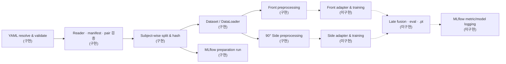

# Config-driven Dual-view Gaze Pipeline

정면 `webcam`과 90° 측면 `phonecam` **정지 이미지**를 같은 데이터 계약으로 준비하는 시선 추정 파이프라인입니다. 현재는 config 검증, manifest/split, Front·Side 전처리와 MLflow data-preparation 기록까지 구현되어 있습니다. 모델 로딩·학습·평가·late fusion은 다음 구현 단계입니다.

## 한눈에 보기

| 영역 | 상태 | 현재 할 수 있는 일 |
|---|---|---|
| Config | **구현** | base + profile + CLI override 병합, 경로·계약 검증 |
| Data | **구현** | MPIIFaceGaze text / generic CSV 읽기, 명시적 pair 검사, subject split |
| Front | **구현** | MediaPipe landmark, EAR, metric head cue, `128×512` 양안 eye strip |
| Side | **구현** | strict 90° annotation, EAR, `128×256` 한쪽 눈 ROI, 선택 feature |
| MLflow | **부분 구현** | config·manifest·split·hash·환경 기록과 UI 검사 |
| Model / train / eval | **미구현** | 외부 모델 adapter, weight import, loss/metric executor |
| Late fusion / export | **미구현** | 두 branch 결합, checkpoint와 최종 `.pt` 저장 |

## 전체 아키텍처



`prepare`는 manifest와 split을 만들고 MLflow에 기록합니다. 이미지 전처리는 `Dataset` item 접근 또는 preview 명령에서 실행되며, 아직 model forward나 학습을 실행하지 않습니다.

### 모델 입력 계약

| Branch | Image 입력 | 보조 feature | 유효성 mask |
|---|---|---|---|
| Front | `front_image [B,3,128,512]` | BlazeGaze 필수: `front_head_vector [B,3]`, `front_face_origin_3d [B,3]` | `front_gaze_valid [B]` |
| Side | `side_image [B,3,128,256]` | config 선택: `side_head_pose_2d [B,2]` 또는 paired Front 3D, `side_eye_angles [B,2]`, `side_iris_pose_2d [B,2]` | `side_gaze_valid [B]` |

- `side_image`는 feature toggle과 관계없이 항상 생성됩니다.
- `side_eye_angles`는 `a0→a1(위 눈꺼풀)`과 `a0→a2(아래 눈꺼풀)` 방향각을 각각 `angle/π`로 저장합니다. 두 벡터를 합치지 않습니다.
- `side_iris_pose_2d`는 iris와 눈꺼풀 중심의 상대 위치입니다. `vertical_only: true`이면 수직 cue만 유지합니다.
- EAR로 감긴 눈을 표시하며 해당 sample은 loss·metric·fusion에서 제외할 수 있습니다.

향후 공통 출력은 `gaze_xy [B,2]`입니다. target `[-0.5, 0.5]`는 화면 중심을 `(0,0)`으로 둔 좌표 규약이며 ReLU 범위가 아닙니다. 음수 좌표가 필요하므로 기본 출력 activation은 `identity`입니다.

상세 계약은 [아키텍처](docs/architecture.md)와 [설정 설명](docs/configuration.md)을 참고하세요.

## 1. 설치와 환경 검사

요구 환경은 Python `3.12`입니다.

```bash
make paths
make setup-dev
make check-setup
make check
```

| 명령 | 확인 내용 |
|---|---|
| `make paths` | 프로젝트·가상환경·config·data·MLflow의 절대경로 |
| `make setup-dev` | `.venv` 생성, runtime + test 도구 설치 |
| `make check-setup` | Python 버전과 Torch/OpenCV/MediaPipe/MLflow 등 실제 import |
| `make check` | config, unit test, Ruff lint/format 전체 검사 |

다른 Python을 쓸 때는 `make setup-dev PYTHON="/absolute/path/to/python3.12"`처럼 지정합니다.

## 2. 합성 이미지 2장으로 MLflow smoke test

실제 데이터를 넣기 전에 별도 `.demo` DB로 다음 경로를 검사합니다.

```bash
make demo-two-images
make demo-mlflow-check
make demo-mlflow-ui MLFLOW_PORT=5001
```

검사 범위는 `generic CSV → manifest → split → hash → MLflow FINISHED run`입니다. model forward·학습 검사는 아닙니다. UI는 [http://127.0.0.1:5001](http://127.0.0.1:5001)에서 확인합니다.

## 3. 실제 데이터 준비

### MPIIFaceGaze Front

```text
MPIIFaceGaze/
└── p01/
    ├── p01.txt
    └── day01/*.jpg
```

```bash
make prepare GAZE_DATA_ROOT="/absolute/path/to/MPIIFaceGaze"
make mlflow-check
make mlflow-ui
```

### 명시적으로 짝지은 Front + Side 이미지

파일명이나 정렬 순서로 pair를 추측하지 않고 CSV의 동일한 `pair_id`로 두 row를 연결합니다.

```csv
sample_id,subject_id,view,image_path,pair_id,target_x_px,target_y_px,screen_width_px,screen_height_px
p01_t001_front,p01,front,/data/p01/webcam/001.jpg,p01_t001,960,540,1920,1080
p01_t001_side,p01,side,/data/p01/phonecam/001.jpg,p01_t001,960,540,1920,1080
```

```bash
DUAL_VIEW_MANIFEST="/absolute/dual_view_manifest.csv" \
make prepare \
  GAZE_DATA_ROOT="/absolute/data/root" \
  PROFILES="configs/profiles/dual_view_images.yaml configs/profiles/blazegaze.yaml configs/profiles/side_profile_90.yaml"
```

필수 column과 annotation 규칙은 [데이터 형식](docs/dataset-format.md)에 있습니다.

## 4. 실제 이미지 전처리 확인

공식 MediaPipe asset과 참고 BlazeGaze weight를 받은 뒤, 예제 이미지의 단계별 plot과 최종 tensor를 확인합니다.

```bash
make webeyetrack-assets
make check-webeyetrack-assets

make preprocess-profile90-preview \
  EXAMPLE_ROOT="/absolute/path/to/example"

make preprocess-profile90-pose-grid \
  EXAMPLE_ROOT="/absolute/path/to/example"
```

`profile90` preview는 Front 2장과 등록된 Side 이미지를 처리합니다. pose-grid 명령은 `side_{head}_{eye}` 형식의 3×3 annotation을 시각화합니다. 생성물은 기본적으로 `outputs/profile90_preprocessing/`과 `outputs/profile90_pose_grid/`에 저장됩니다.

## 5. 두 학습 경로

현재 두 경로 모두 **model 학습 명령은 아직 없습니다**. 아래는 config와 전처리 계약이 준비된 범위 및 다음 구현 순서입니다.

| 경로 | Config stack | 준비 완료 | 남은 구현 |
|---|---|---|---|
| Front | base + `blazegaze.yaml` | 양안 eye strip, EAR, metric head cue | `.keras` importer/adapter → forward → trainer |
| Side | base + dual-view + `blazegaze.yaml` + `side_profile_90.yaml` | 한쪽 눈 ROI, 선택 feature, paired Front cue 전환 | encoder transfer 또는 새 backbone → trainer |
| Fusion | paired Front/Side batch | pair 검증과 branch validity | 두 embedding/prediction의 late-fusion module → joint eval |

의도한 학습 순서는 다음과 같습니다.

1. Front encoder를 먼저 학습하거나 공식 WebEyeTrack weight를 adapter로 불러옵니다.
2. Side encoder는 WebEyeTrack convolution encoder를 전이하거나 새 backbone으로 독립 학습합니다.
3. 두 branch를 고정하거나 함께 fine-tune하면서 paired sample만 late fusion에 사용합니다.
4. validation metric으로 best `.pt`를 선택하고 MLflow에 metric·checkpoint·resolved config를 기록합니다.

YAML의 `training`, `optimizer`, `loss`, `metrics`, `checkpoint`, `model_export`, `fusion`은 이 runner를 위한 **설계 계약**이며 현재 실행되지는 않습니다. `.pkl` 전체 객체보다 재현성과 보안성이 나은 PyTorch `state_dict` 기반 `.pt`를 기본 형식으로 정했습니다.

## 6. Configuration

설정 우선순위는 다음과 같습니다.

```text
configs/config.yaml < --profile을 적은 순서 < dotted CLI override
```

```bash
# 파일 경로 확인 없이 base 검증
make validate-config

# 현재 dual-view 조합 검증
make validate-config \
  PROFILES="configs/profiles/dual_view_images.yaml configs/profiles/blazegaze.yaml configs/profiles/side_profile_90.yaml"

# 마지막 한 값만 변경
make validate-config OVERRIDES="data.dataloader.batch_size=16"
```

| Section | 의미 | 현재 사용 |
|---|---|---|
| `experiment`, `paths` | run 이름·seed·출력 위치 | 구현 |
| `task` | `gaze_xy` 좌표와 출력 계약 | 검증 구현 |
| `data.reader/views/pairing/split` | 입력 읽기, branch, pair, subject split | 구현 |
| `data.dataloader` | batch size와 worker | 구현 |
| `preprocessing` | 공통 단계와 branch별 override | 구현 |
| `model.*.input_contract` | 전처리 tensor와 외부 모델의 경계 | 검증만 구현 |
| `mlflow` | preparation run의 params/artifacts | 구현 |
| `training`~`model_export`, `fusion` | 향후 학습 runner 계약 | 미구현 |

현재 사용하는 profile은 다음과 같습니다.

- `configs/profiles/blazegaze.yaml`: Front WebEyeTrack-compatible 입력
- `configs/profiles/dual_view_images.yaml`: generic CSV와 명시적 Front/Side pairing
- `configs/profiles/side_profile_90.yaml`: annotation-first 90° 한쪽 눈 입력과 feature toggle
- `configs/profiles/demo_two_images.yaml`: 독립 smoke test

각 YAML에는 비자명한 parameter의 단위·허용값·실패 정책과 `(구현)/(미구현)` 상태를 가까운 주석으로 표시했습니다. 전체 필드 설명은 [configuration.md](docs/configuration.md)에 있습니다.

## 7. 결과 위치

| 경로 | 내용 | 상태 |
|---|---|---|
| `outputs/<experiment>/<run>/` | resolved config와 `manifests/`의 전체/split manifest·hash·summary | 현재 생성 |
| `mlflow.db`, `mlruns/` | 로컬 MLflow metadata/artifact | 현재 생성, Git 제외 |
| `outputs/profile90_*` | 단계별 전처리 plot과 JSON report | preview 실행 시 생성 |
| `.../checkpoints/*.pt` | best/last checkpoint | 미구현 |
| `.../models/final_weights.pt` | 최종 state dict + contract | 미구현 |
| `.../metrics`, `.../predictions` | 평가 metric·예측 | 미구현 |

로컬 생성물을 정리하려면 `make clean-cache`를 사용합니다. `.venv`, output, MLflow 이력은 데이터 손실을 피하기 위해 별도 관리합니다.

## 주요 파일

```text
configs/                  base와 profile YAML
src/gaze_pipeline/        config, data, preprocessing, MLflow preparation
scripts/                  환경·asset·preview·MLflow 검사
tests/                    contract와 transform test
docs/                     상세 아키텍처·config·data 형식
Makefile                  재현 가능한 주요 명령
CONTRIBUTING.md           기능 추가와 PR 규칙
```

개발 규칙은 [CONTRIBUTING.md](CONTRIBUTING.md)를 참고하세요. 얼굴·시선·subject ID·manifest·로컬 경로는 민감 정보이므로 raw data, `outputs/`, `mlruns/`, `mlflow.db`, 모델 weight를 Git에 올리지 마세요.

참고: [WebEyeTrack 논문](https://arxiv.org/html/2508.19544v1), [공식 저장소](https://github.com/RedForestAI/WebEyeTrack)
