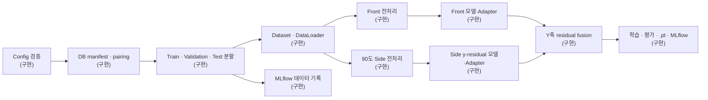

# Dual-view Gaze Pipeline

새로 수집할 정면 `webcam`과 90도 측면 `phonecam` 정지 이미지로 시선 추정 모델을 학습·평가하는 config 기반 PyTorch 파이프라인입니다.

현재 구현 범위는 **DB manifest 검증 → 사람 단위 split → Front/Side 전처리 → 외부 모델 adapter → 학습·평가 → Y축 residual fusion → checkpoint/MLflow 기록**입니다.

## 아키텍처



| 단계 | 상태 |
|---|---|
| Generic CSV DB reader, 명시적 `pair_id`, 사람 단위 split | 구현 |
| Front BlazeGaze 입력과 Side 한쪽 눈 입력 | 구현 |
| EAR, head pose, 눈 방향 feature | 구현 |
| MLflow manifest·config·환경 기록 | 구현 |
| Generic PyTorch 모델 adapter, pretrained state_dict | 구현 |
| 학습·평가 loop, loss·metric, best/last/final `.pt` | 구현 |
| Front 고정 x + Side y-residual fusion | 구현 |
| 공식 WebEyeTrack Front `.keras` 실행 | 구현 (`Keras 3` torch backend wrapper, SHA 검증) |

## 새로 구축할 DB

기본 config는 기존 실험 데이터를 읽지 않습니다. `data.reader.type: generic_csv`로 설정되어 있으며 새로 만든 `DUAL_VIEW_MANIFEST`만 데이터 입력으로 사용합니다.

`mlflow.db`는 이미지 DB가 아니라 실행 기록을 저장하는 파일이므로 학습 데이터를 제공하지 않습니다.

권장 폴더 구조:

```text
dual_view/
└── <subject_id>/
    ├── webcam/
    │   └── *.jpg
    └── phonecam/
        └── *.jpg
```

촬영할 때 이미지와 함께 manifest를 만듭니다.

```csv
sample_id,subject_id,view,image_path,pair_id,target_x_px,target_y_px,screen_width_px,screen_height_px
p001_001_front,p001,webcam,p001/webcam/001.jpg,p001_001,960,540,1920,1080
p001_001_side,p001,phonecam,p001/phonecam/001.jpg,p001_001,960,540,1920,1080
```

- 같은 촬영 시점의 Front/Side 이미지는 동일한 `pair_id`를 사용합니다.
- 같은 사람의 이미지는 항상 같은 split에 배정됩니다.
- 파일명이나 정렬 순서로 pair를 추측하지 않습니다.
- 90도 Side 전처리에는 눈 bbox·눈꺼풀 6점·iris 중심·머리 기준점 annotation이 추가로 필요합니다.

전체 column 설명은 [데이터 형식](docs/dataset-format.md)에 있습니다.

## 설치와 검사

Python `3.12`를 사용합니다.

```bash
make paths
make setup-dev
make check-setup
make check
```

| 명령 | 기능 |
|---|---|
| `make paths` | 프로젝트와 DB, output, MLflow 절대경로 확인 |
| `make setup-dev` | `.venv`와 전체 의존성 설치 |
| `make check-setup` | Python과 주요 package import 확인 |
| `make check` | config, test, lint, format 검사 |
| `make demo-dual-train` | 합성 Front/Side DB로 전체 학습·Y축 fusion·checkpoint 검사 |
| `make data-ver1-preview` | p00/p03 실제 전처리를 단계별 이미지로 저장 |
| `make data-ver1-smoke` | 공식 Front + 간단한 Side 학습·평가·MLflow 검사 |
| `make train` | PyTorch 모델과 지원되는 primary loss·optimizer로 학습하고 checkpoint 기록 |
| `make evaluate` | validation/test split을 checkpoint로 평가 |

## DB 준비와 MLflow 확인

먼저 합성 이미지 2장으로 실행 환경을 확인합니다.

```bash
make demo-two-images
make demo-mlflow-check
make demo-mlflow-ui MLFLOW_PORT=5001
```

Front/Side 모델과 Y축 residual fusion까지 한 번에 검사하려면 다음을 실행합니다.

```bash
make demo-dual-train
```

이 명령은 `.demo/dual_view_training`에 비생체 합성 이미지와 annotation manifest를 만들고
2 epoch 학습 후 best/last/final `.pt`를 저장하고 별도 `mlflow-training-demo.db`의 FINISHED
training run까지 검사합니다. 연결 확인용이며 모델 정확도 benchmark는 아닙니다.

실제 `data(ver1)`의 p00/p03으로 read-only smoke를 실행하려면 먼저 source manifest를 만듭니다.

```bash
make data-ver1-preview
make data-ver1-smoke
```

첫 명령은 `outputs/preprocessing_ver1_preview/`에 plot을 저장합니다. 두 번째 명령은 manifest 생성,
MLflow data-preparation 기록, 1 epoch 학습, checkpoint 재로딩 validation 평가, MLflow DB 검사를 순서대로 수행합니다.
아래는 manifest와 prepare만 따로 실행하는 방법입니다.

```bash
DATA_VER1_ROOT='/Users/seungyeonlee/Library/Mobile Documents/com~apple~CloudDocs/02. FLYAI/project_data/data(ver1)'
DATA_VER1_MANIFEST="$PWD/.demo/data_ver1_smoke/manifest.csv"

.venv/bin/python scripts/create_data_ver1_manifest.py \
  --source-root "$DATA_VER1_ROOT" \
  --output-manifest "$DATA_VER1_MANIFEST" \
  --dummy-side-annotations --force

GAZE_DATA_ROOT="$DATA_VER1_ROOT" \
GAZE_OUTPUT_ROOT="$PWD/.demo/data_ver1_smoke/outputs" \
DATA_VER1_MANIFEST="$DATA_VER1_MANIFEST" \
WEBEYETRACK_WEIGHTS="$PWD/models/blazegaze_mpiifacegaze.keras" \
MLFLOW_TRACKING_URI="sqlite:///$PWD/.demo/data_ver1_smoke/mlflow.db" \
.venv/bin/python -m gaze_pipeline prepare \
  --config configs/config.yaml \
  --profile configs/profiles/blazegaze.yaml \
  --profile configs/profiles/side_profile_90.yaml \
  --profile configs/profiles/data_ver1_smoke.yaml
```

같은 profile 조합으로 `train`을 실행하면 공식 WebEyeTrack Front factory, 눈 이미지와 선택 feature를
함께 소비하는 작은 Side residual smoke model, Y축 fusion을 1 epoch 연결하고 MLflow에 기록합니다. 원본 DB의 image는 복사하거나
수정하지 않으며, manifest와 output은 반드시 원본 DB 밖에 둡니다. 이 smoke split은 원본 protocol
열을 무시하고 p00 전체를 train, p03 전체를 validation에 배정하며 test는 비어 있습니다.

Side annotation이 필요하면 생성 명령에 `--dummy-side-annotations --force`를 추가할 수 있습니다.
이 값은 p00/p03별 고정 좌표를 넣는 배선 확인용 데이터일 뿐 정답 label이나 성능 학습용 annotation이
아닙니다. `annotation_source=dummy_smoke` 표시는 생성한 source manifest에만 남고 현재 generic
canonical prepare에는 보존되지 않습니다. 이 옵션이 없으면 Side annotation은 빈 값이고
`eye_annotation_valid=false`입니다. phonecam은 촬영 설계상 90도 바로 측면으로 사용합니다.
다만 원본 `participant.json`의 `position`에는 `participant_left_30_45_deg`가 남아 있어 촬영 의도와
metadata가 충돌합니다. pipeline은 사용자 확인에 따라 strict 90도 계약을 사용하며, 정식 DB를
확정할 때 원본 metadata도 함께 바로잡아야 합니다.

`data_ver1_smoke.yaml`은 Front EAR gate를 끕니다. 이 DB는 수집 단계에서 눈 감김을 제거했다는
계약을 따르며, 실제로 EAR 0.20에서 탈락했던 p03의 5장은 육안상 눈을 뜬 정상 frame이었습니다.
EAR 구현 자체는 실시간 WebEyeTrack에서 blink frame을 차단할 때 사용할 수 있도록
`blazegaze.yaml`에 선택 기능으로 남겨 둡니다.

새 DB가 준비되면 manifest와 split을 생성합니다.

```bash
DUAL_VIEW_MANIFEST="/absolute/path/to/dual_view_manifest.csv" \
make prepare GAZE_DATA_ROOT="/absolute/path/to/dual_view"

make mlflow-check
make mlflow-ui
```

이 단계는 이미지를 복사하지 않고 경로, pair, label, split, hash를 기록합니다.

## 학습과 평가

모델 코드는 pipeline에 복사하지 않아도 됩니다. 각 branch에
`source_dir`, `entrypoint`, `adapter_entrypoint`, `init_args`를 지정하면 generic runner가
동적으로 불러옵니다. `pretrained.path`는 PyTorch `.pt`/`.pth` state_dict를 지원하며 SHA-256과
strict load를 적용할 수 있습니다.

```yaml
model:
  front:
    entrypoint: my_models.front:create_model
    adapter_entrypoint: my_models.front:create_adapter
    init_args: {hidden_dim: 256}
    pretrained:
      path: /absolute/path/to/front_weights.pt
      sha256: null
      strict: true
```

`entrypoint: null`이면 입출력 계약을 확인할 수 있는 작은 기본 PyTorch 회귀 모델을 사용합니다.
이는 연결 smoke test용이며 실제 성능 모델을 대신하지 않습니다. generic `pretrained.path`는
`.pt`/`.pth` state_dict 전용입니다. 공식 WebEyeTrack Front `.keras`는 별도 factory가 archive
SHA-256을 검증하고 Keras 3의 torch backend로 안전하게 불러오며, 위 `data_ver1_smoke`
profile이 그 factory를 연결합니다. 임의 Keras 모델을 가져오는 범용 importer는 아닙니다.

아래 profile 조합도 `model.front.entrypoint`와 `model.side.entrypoint`를 따로 지정하지 않으면
BlazeGaze 자체가 아니라 내장 fallback 모델을 학습합니다. 실제 모델 학습에서는 각 branch의
PyTorch factory와, signature가 canonical batch와 다를 때 adapter를 반드시 연결합니다.

```bash
make train \
  GAZE_DATA_ROOT="/absolute/path/to/dual_view" \
  DUAL_VIEW_MANIFEST="/absolute/path/to/dual_view_manifest.csv" \
  PROFILES="configs/profiles/blazegaze.yaml configs/profiles/side_profile_90.yaml" \
  OVERRIDES="experiment.run_name=dual_view_run_01 model.front.source_dir=/absolute/front_code model.front.entrypoint=my_front:create_model model.side.source_dir=/absolute/side_code model.side.entrypoint=my_side:create_model"

make evaluate \
  GAZE_DATA_ROOT="/absolute/path/to/dual_view" \
  DUAL_VIEW_MANIFEST="/absolute/path/to/dual_view_manifest.csv" \
  PROFILES="configs/profiles/blazegaze.yaml configs/profiles/side_profile_90.yaml" \
  EVAL_SPLIT=test \
  OVERRIDES="experiment.run_name=dual_view_run_01 model.front.source_dir=/absolute/front_code model.front.entrypoint=my_front:create_model model.side.source_dir=/absolute/side_code model.side.entrypoint=my_side:create_model"
```

위 명령은 한 줄이 길어 보이지만 `OVERRIDES` 안의 model 경로·entrypoint 네 값이 실제 모델을
연결하는 핵심입니다. 평가는 학습 때와 동일한 model 연결 override도 함께 사용해야 합니다.

`CHECKPOINT=/absolute/model.pt`를 주면 해당 파일을 평가합니다. 생략하면
`checkpoint.resume_from`, 그마저 없으면 현재 resolved run의 best checkpoint 경로를
사용합니다. 기본 `run_name`은 실행 시각을 포함하므로 checkpoint를 생략할 때는 위 예시처럼
학습과 평가에 같은 `experiment.run_name`을 지정해야 합니다.

두 branch를 함께 켠 generic dual-view runner는 완전한 Front/Side pair만 학습합니다.
`unpaired_policy: branch_only`는 불완전 row를 prepared manifest와 single-view Dataset에 남기는
정책이며, 해당 row를 학습하려면 Front-only 또는 Side-only run을 별도로 실행해야 합니다.

## 전처리 확인

```bash
make webeyetrack-assets
make check-webeyetrack-assets

make preprocess-profile90-preview \
  EXAMPLE_ROOT="/absolute/path/to/example"

make preprocess-profile90-pose-grid \
  EXAMPLE_ROOT="/absolute/path/to/example"
```

## 모델 입력 계약

실행 시 runtime은 primary image와 선택된 auxiliary 입력의 key·shape·dtype·finite 여부 및
`value_range`, 그리고 표준 출력 shape을 첫 forward부터 검사합니다.

| Branch | 이미지 | 추가 feature |
|---|---|---|
| Front | `front_image [B,3,128,512]` | `front_head_vector [B,3]`, `front_face_origin_3d [B,3]` |
| Side | `side_image [B,3,128,256]` | config에서 선택한 head pose, eye angle, iris pose |

Side 이미지 ROI는 항상 생성되고 아래 feature만 config로 선택합니다.

```yaml
feature_extraction:
  side_headpose:
    enabled: true
    source: side_2d       # side_2d 또는 paired Front의 front_3d
  side_eyeangle:
    enabled: true         # a0→a1, a0→a2 방향각
  side_eyelidangle:
    enabled: true         # iris의 눈꺼풀 기준 상대 위치
    vertical_only: true
```

Side 출력은 전체 `(x,y)`가 아니라 `delta_y_side [B,1]`입니다. 최종 좌표는 다음처럼
결합되어 Side가 x축을 변경하지 않습니다.

```text
x_final = x_front
y_final = y_front + w_y * delta_y_side
```

## Config 구성

```text
configs/config.yaml
  + configs/profiles/blazegaze.yaml
  + configs/profiles/side_profile_90.yaml
  + CLI override
```

```bash
make validate-config \
  PROFILES="configs/profiles/blazegaze.yaml configs/profiles/side_profile_90.yaml"

make validate-config OVERRIDES="data.dataloader.batch_size=16"
```

| 파일 | 역할 |
|---|---|
| `configs/config.yaml` | 새 dual-view DB, split, 공통 전처리와 실행 설정 |
| `configs/profiles/blazegaze.yaml` | Front 입력 전처리 계약 |
| `configs/profiles/side_profile_90.yaml` | 90도 Side 한쪽 눈과 feature 설정 |
| `configs/profiles/demo_two_images.yaml` | 합성 Front 데이터·MLflow smoke test |
| `configs/profiles/demo_dual_view_training.yaml` | 합성 dual-view 전체 학습 smoke test |

## 결과

`prepare`, `train`, `evaluate`가 생성하는 주요 결과:

```text
outputs/<experiment>/<run>/resolved_config.yaml
outputs/<experiment>/<run>/manifests/*.csv
outputs/<experiment>/<run>/checkpoints/best_weights.pt
outputs/<experiment>/<run>/checkpoints/last_checkpoint.pt
outputs/<experiment>/<run>/models/final_weights.pt
outputs/<experiment>/<run>/metrics/
outputs/<experiment>/<run>/predictions/
mlflow.db
```

`prepare`를 실행하면 data-preparation run이, `train`과 `evaluate`를 실행하면 각각 training과
evaluation run이 생성됩니다. training run에는 manifest/config hash와 loss·metric,
`training/checkpoints/{best,last}`, `training/model/final`이 기록됩니다. evaluation run에는 입력
checkpoint와 `evaluation/<split>/metrics`가 기록됩니다. prediction은
`mlflow.log_predictions=true`일 때만 `subject_id`를 제거한 사본을
`evaluation/<split>/predictions`에 올립니다. 원본 얼굴 이미지는 artifact로 올리지 않습니다.

상세 내용은 [아키텍처](docs/architecture.md), [설정 설명](docs/configuration.md), [기여 가이드](CONTRIBUTING.md)를 참고하세요.
