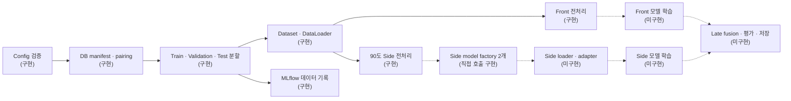

# Dual-view Gaze Pipeline

새로 수집할 정면 `webcam`과 90도 측면 `phonecam` 정지 이미지로 시선 추정 데이터를 준비하는 config 기반 파이프라인입니다.

현재 data pipeline 범위는 **DB manifest 검증 → 사람 단위 split → Front/Side 전처리 → MLflow 데이터 준비 기록**입니다. 이와 별도로 직접 import해 실행할 수 있는 Side model factory 두 개와 BlazeGaze encoder weight converter가 구현되어 있습니다. Runtime model loader/adapter, 모델 학습과 late fusion은 아직 구현되지 않았습니다.

## 아키텍처



| 단계 | 상태 |
|---|---|
| Generic CSV DB reader, 명시적 `pair_id`, 사람 단위 split | 구현 |
| Front BlazeGaze 입력과 Side 한쪽 눈 입력 | 구현 |
| EAR, head pose, 눈 방향 feature | 구현 |
| MLflow manifest·config·환경 기록 | 구현 |
| Side model factory: MobileNetV4-Conv-S, BlazeGaze transfer | 구현—직접 import 실행 |
| Side model profile과 config contract validation | 구현—runtime 자동 loading은 아님 |
| BlazeGaze `.keras` encoder-only converter | 구현—TensorFlow는 변환 시에만 선택 사용 |
| Front Encoder | 미구현 |
| Model loader/registry와 adapter | 미구현 |
| Trainer, loss, metric, optimizer, scheduler와 checkpoint | 미구현 |
| Late fusion | 미구현 |

## 새로 구축할 DB

기본 config는 기존 실험 데이터를 읽지 않습니다. `data.reader.type: generic_csv`로 설정되어 있으며 새로 만든 `DUAL_VIEW_MANIFEST`만 데이터 입력으로 사용합니다.

`mlflow.db`는 이미지 DB가 아니라 실행 기록을 저장하는 파일이므로 학습 데이터를 제공하지 않습니다.

권장 폴더 구조:

```text
dual_view/
└── <subject_id>/
    ├── webcam/
    │   └── *.jpg
    └── phonecam/
        └── *.jpg
```

촬영할 때 이미지와 함께 manifest를 만듭니다.

```csv
sample_id,subject_id,view,image_path,pair_id,target_x_px,target_y_px,screen_width_px,screen_height_px
p001_001_front,p001,webcam,p001/webcam/001.jpg,p001_001,960,540,1920,1080
p001_001_side,p001,phonecam,p001/phonecam/001.jpg,p001_001,960,540,1920,1080
```

- 같은 촬영 시점의 Front/Side 이미지는 동일한 `pair_id`를 사용합니다.
- 같은 사람의 이미지는 항상 같은 split에 배정됩니다.
- 파일명이나 정렬 순서로 pair를 추측하지 않습니다.
- 90도 Side 전처리에는 눈 bbox·눈꺼풀 6점·iris 중심·머리 기준점 annotation이 추가로 필요합니다.

전체 column 설명은 [데이터 형식](docs/dataset-format.md)에 있습니다.

## 설치와 검사

Python `3.12`를 사용합니다.

```bash
make paths
make setup-dev
make check-setup
make check
```

| 명령 | 기능 |
|---|---|
| `make paths` | 프로젝트와 DB, output, MLflow 절대경로 확인 |
| `make setup-dev` | `.venv`와 전체 의존성 설치 |
| `make check-setup` | Python과 주요 package import 확인 |
| `make check` | config, test, lint, format 검사 |

## DB 준비와 MLflow 확인

먼저 합성 이미지 2장으로 실행 환경을 확인합니다.

```bash
make demo-two-images
make demo-mlflow-check
make demo-mlflow-ui MLFLOW_PORT=5001
```

새 DB가 준비되면 manifest와 split을 생성합니다.

```bash
DUAL_VIEW_MANIFEST="/absolute/path/to/dual_view_manifest.csv" \
make prepare GAZE_DATA_ROOT="/absolute/path/to/dual_view"

make mlflow-check
make mlflow-ui
```

이 단계는 이미지를 복사하지 않고 경로, pair, label, split, hash를 기록합니다.

## 전처리 확인

```bash
make webeyetrack-assets
make check-webeyetrack-assets

make preprocess-profile90-preview \
  EXAMPLE_ROOT="/absolute/path/to/example"

make preprocess-profile90-pose-grid \
  EXAMPLE_ROOT="/absolute/path/to/example"
```

## 모델 입력 계약

| Branch | 이미지 | 추가 feature |
|---|---|---|
| Front | `front_image [B,3,128,512]` | `front_head_vector [B,3]`, `front_face_origin_3d [B,3]` |
| Side | `side_image [B,3,128,256]` | config에서 선택한 head pose, eye angle, iris pose |

Side factory의 출력은 `delta_y_side [B,1]`, `side_embedding [B,256]`과 optional
`quality [B,1]`입니다. `delta_y_side`는 Front y에 더하는 centered-normalized residual이며
Side model은 독립적인 x 좌표를 출력하지 않습니다. 두 구현의 entrypoint, 직접 실행법과
converter 사용법은 [Side Encoder 문서](docs/side-encoders.md)를 참고하세요.

Side 이미지 ROI는 항상 생성되고 아래 feature만 config로 선택합니다.

```yaml
feature_extraction:
  side_headpose:
    enabled: true
    source: side_2d       # side_2d 또는 paired Front의 front_3d
  side_eyeangle:
    enabled: true         # a0→a1, a0→a2 방향각
  side_eyelidangle:
    enabled: true         # iris의 눈꺼풀 기준 상대 위치
    vertical_only: true
```

## Config 구성

```text
configs/config.yaml
  + configs/profiles/blazegaze.yaml
  + configs/profiles/side_profile_90.yaml
  + configs/models/<selected-side-model>.yaml
  + CLI override
```

```bash
make validate-config \
  PROFILES="configs/profiles/blazegaze.yaml configs/profiles/side_profile_90.yaml"

make validate-config OVERRIDES="data.dataloader.batch_size=16"
```

| 파일 | 역할 |
|---|---|
| `configs/config.yaml` | 새 dual-view DB, split, 공통 전처리와 실행 설정 |
| `configs/profiles/blazegaze.yaml` | Front 입력 전처리 계약 |
| `configs/profiles/side_profile_90.yaml` | 90도 Side 한쪽 눈과 feature 설정 |
| `configs/models/side_blazegaze_transfer.yaml` | BlazeGaze transfer factory override |
| `configs/models/side_mobilenet_v4.yaml` | MobileNetV4 factory override |
| `configs/profiles/demo_two_images.yaml` | 합성 데이터 smoke test |

Model profile을 마지막에 적용하면 entrypoint와 contract가 resolve되지만, 현재 training이나
inference runtime이 이를 읽어 model을 자동 생성하지는 않습니다.

## 결과

현재 생성되는 결과:

```text
outputs/<experiment>/<run>/resolved_config.yaml
outputs/<experiment>/<run>/manifests/*.csv
mlflow.db
mlruns/
```

`checkpoint/*.pt`, 예측 metric과 fusion 결과는 학습 실행기 구현 후 생성됩니다.

상세 내용은 [Side Encoder](docs/side-encoders.md), [아키텍처](docs/architecture.md),
[설정 설명](docs/configuration.md), [기여 가이드](CONTRIBUTING.md)를 참고하세요.
