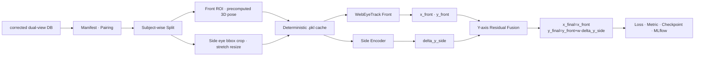

# Pipeline architecture

## 1. 목표와 실행 범위

이 프로젝트는 모델 구현을 데이터 코드에 고정하지 않고 YAML로 다음 항목을 조합합니다.

- 데이터 경로, pairing, subject-wise split
- Front/Side 전처리와 전처리 cache
- 모델 factory, adapter, pretrained weight
- loss, metric, optimizer, scheduler
- Y축 residual fusion, checkpoint, MLflow

실행 가능한 CLI는 `validate-config`, `prepare`, `train`, `evaluate`입니다. 외부 PyTorch 모델은
`package.module:callable` entrypoint로 불러오며, 공식 WebEyeTrack Front `.keras`는 전용 Keras 3
torch-backend wrapper로 실행합니다.

## 2. 전체 흐름



`prepare`는 manifest와 split을 검증·기록합니다. 실제 pixel 전처리는 `train`과 `evaluate`가
Dataset을 순회할 때 실행하며, 동일한 결정적 전처리 결과가 있으면 cache에서 읽습니다.

## 3. Production Config 조합

Config는 앞에서 뒤로 덮어씁니다. 모델 profile은 마지막에 둡니다.

```text
configs/config.yaml
  → configs/profiles/blazegaze.yaml
  → configs/profiles/side_profile_90.yaml
  → configs/profiles/side_roi_only.yaml
  → configs/profiles/measured_head_down_neutral.yaml
  → configs/models/front_webeyetrack.yaml
  → configs/models/<selected-side-model>.yaml
  → CLI override
```

현재 연결된 Side 선택지는
[`side_mobilenet_v4.yaml`](../configs/models/side_mobilenet_v4.yaml)과
[`side_blazegaze_transfer.yaml`](../configs/models/side_blazegaze_transfer.yaml)입니다.

## 4. 데이터와 유효성 경계

현재 측정 DB는 각 피험자의 `head_down`, `neutral` session만 사용합니다.

```text
<subject>/<session>/feature_maps/
├── web/frames/                 # corrected Front source
├── phone/frames/               # corrected Side source
├── training.csv
├── evaluation.csv
└── webeyetrack/inputs.csv      # valid, head_vector, face_origin
```

`inputs.csv.valid`는 수집·상류 전처리가 만든 승인 결과입니다. Builder는 `valid=0`인 Front와 같은
`pair_id`의 Side를 함께 제외합니다. Pipeline 내부에는 눈 상태 비율을 다시 계산하는 stage가 없고,
상류 CSV의 개별 진단 열도 모델 입력으로 전달하지 않습니다.

Front pose도 `inputs.csv`의 다음 값만 사용합니다.

```text
front_head_vector:    float32[B,3]
front_face_origin_3d: float32[B,3], cm
```

측정 profile은 `metric_head_pose.source: precomputed_only`이므로 값이 없거나 유효하지 않으면
재구성으로 숨기지 않고 중단합니다.

## 5. 전처리 계약

### Front

```text
corrected web frame
→ MediaPipe 478 landmarks
→ WebEyeTrack face homography
→ 양쪽 눈 strip 128×512
→ RGB float32 CHW [0,1]
```

모델 입력은 다음과 같습니다.

```text
front_image:          float32[B,3,128,512]
front_head_vector:    float32[B,3]
front_face_origin_3d: float32[B,3]
front_gaze_valid:     bool[B]  # pose/landmark/ROI 품질 mask
```

기존 `feature_maps/webeyetrack/eye_roi`는 읽지 않습니다. Corrected frame에서 다시 만든 ROI를 이미
전처리된 ROI에 또 적용하는 이중 전처리도 허용하지 않습니다.

### Side

image-only 학습의 최소 annotation은 frame별 `visible_eye_bbox_xyxy`입니다.
[`side_roi_only.yaml`](../configs/profiles/side_roi_only.yaml)은 bbox를 원본 경계 안에서 자른 뒤
`128×256`으로 직접 resize합니다.

```text
corrected phone frame
→ 사람·frame별 eye bbox crop
→ direct stretch resize 128×256
→ RGB float32 CHW [0,1]
```

이 방식은 종횡비를 보존하지 않지만 검은 letterbox padding을 만들지 않으며, 서로 다른 크기의
bbox도 같은 `side_image [B,3,128,256]` 계약으로 만듭니다. Bbox는 실제 frame에서 추출·검수한
값이어야 하며 피험자 공통 고정 좌표나 더미 좌표를 사용하지 않습니다.

추가 annotation이 있으면 다음 feature를 선택할 수 있습니다.

| Config toggle | 모델 입력 | 필요한 annotation |
|---|---|---|
| `side_headpose` | `side_head_pose_2d [B,2]` 또는 paired `front_head_vector [B,3]` | Side head anchor 2점 또는 Front pose |
| `side_eyeangle` | `side_eye_angles [B,2]` | 눈꺼풀 6점 |
| `side_eyelidangle` | `side_iris_pose_2d [B,2]` | 눈꺼풀 6점과 iris 중심 |

`side_image`는 항상 포함됩니다. `forward_keys: auto`는 활성화된 feature만 image 뒤에 추가합니다.
Annotation이 없는 image-only 학습에서는 세 toggle을 모두 `false`로 둡니다.

## 6. 전처리 cache

[`preprocessing_cache.py`](../src/gaze_pipeline/data/preprocessing_cache.py)는 augmentation 직전의
결정적 sample을 하나의 `.pkl` shard로 저장합니다. Cache key에는 다음 항목이 포함됩니다.

- preprocessing/task Config와 augmentation 경계·옵션
- manifest row와 view
- train/validation/test split
- source image 경로와 bytes SHA-256
- cache schema와 implementation ID

따라서 bbox, Config 또는 원본 image가 바뀌면 기존 shard를 재사용하지 않습니다. Augmentation은
저장하지 않고 cache hit 뒤 매 epoch 다시 적용합니다. 지원 mode는 `read_write`, `read_only`,
`refresh`입니다.

Pickle은 안전한 교환 형식이 아닙니다. `trusted_local: true`는 pipeline이 만든 비공유 로컬
폴더에만 사용하고, 다운로드한 cache를 열어서는 안 됩니다.

## 7. 모델 adapter와 출력

```text
canonical batch
→ adapter.to_model_inputs()
→ external model forward
→ adapter.to_standard_outputs()
→ standard output contract 검사
```

| Branch | 필수 출력 |
|---|---|
| Front | `gaze_xy [B,2]` |
| Side | `delta_y_side [B,1]` |
| Fusion | 최종 `gaze_xy [B,2]` |

Runtime은 key, shape, dtype, finite/value range와 출력 shape를 검사합니다. 외부 모델의 좌표계와
의미까지 자동으로 증명하지는 않으므로 adapter 통합 테스트가 필요합니다.

## 8. Y축 fusion

```text
x_final = x_front
y_final = y_front + w_y * delta_y_side
```

`fusion.residual_weight`는 `w_y`의 초기값이고 `learnable_weight=true`이면 optimizer가 학습합니다.
Side ROI가 무효이면 residual을 0으로 두어 유효한 Front 결과를 그대로 사용합니다. Side는 x축을
변경하지 않습니다.

## 9. 학습·평가·기록

학습 objective와 결과 metric은 Config에서 독립적으로 선택합니다.

- loss: `huber_xy`, `mse_xy`, `weighted_l2_xy`
- normalized metric: Euclidean mean/median, x/y MAE, RMSE, OOB, subject macro
- 조건부 metric: 화면 해상도가 있으면 pixel, 실제 화면 크기가 있으면 cm
- threshold accuracy: 설정한 거리 이내 sample 비율

`metrics.selection_metric`이 best checkpoint 기준이고, 현재 측정 profile은 물리 화면 크기가 없어
`subject_macro_euclidean_normalized`를 사용합니다.

```text
outputs/<experiment>/<run>/
├── resolved_config.yaml
├── manifests/
├── checkpoints/best_weights.pt
├── checkpoints/last_checkpoint.pt
├── models/final_weights.pt
├── metrics/
└── predictions/
```

모델과 checkpoint는 state-dict 기반 `.pt`, 전처리 cache만 `.pkl`입니다. MLflow는 Config,
epoch loss/metric, checkpoint lineage와 평가 결과를 기록합니다. 원본 얼굴 image와 피험자 ID가
포함된 artifact는 측정 profile에서 기본 업로드하지 않습니다.

## 10. 현재 제한

- 공식 WebEyeTrack Front 이외의 범용 Keras importer는 없습니다.
- Side bbox/keypoint를 자동 생성하는 detector는 이 runtime의 책임이 아닙니다.
- Side 2D geometry feature는 calibrated screen gaze나 3D head rotation이 아닙니다.
- 물리 화면 크기가 없으면 cm metric을 계산할 수 없습니다.
- WebEyeTrack의 first-order MAML stage는 포함하지 않습니다.
