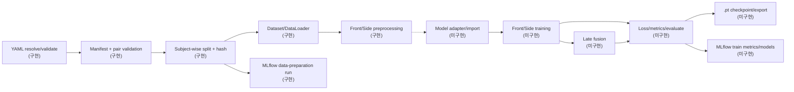
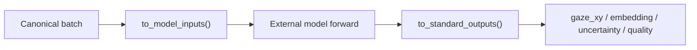
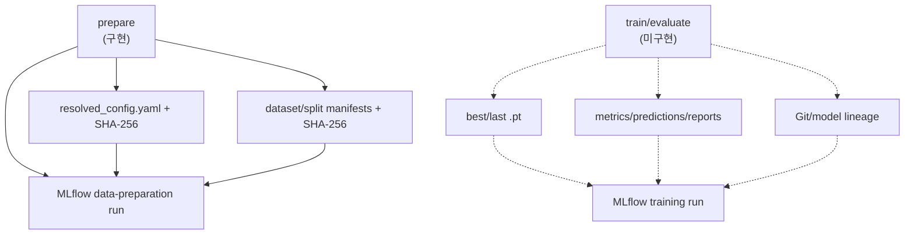

# Pipeline architecture

## 1. 목표와 현재 범위

목표는 모델 구현을 pipeline에 hard-code하지 않고 다음 세 가지로 학습·평가·저장이 가능하게 하는 것입니다.

```text
1. import 가능한 model entrypoint 또는 외부 model source 주소
2. model별 init args와 I/O adapter contract
3. dataset/preprocessing/training/fusion/MLflow config
```

현재 repository는 config validation, MPIIFaceGaze/generic reader, canonical manifest,
subject-wise split, ordered preprocessing, PyTorch Dataset/DataLoader, MLflow preparation
tracking까지 구현되어 있습니다. model adapter/registry, trainer, loss/metric executor,
checkpoint와 late-fusion module은 다음 단계입니다.

현재 public CLI는 `validate-config`와 `prepare`뿐입니다. `prepare`는 manifest/split과
재현성 artifact를 만들고 MLflow에 data-preparation run을 기록하지만, Dataset을 순회하거나
MediaPipe/eye warp를 실행하지는 않습니다. 실제 pixel 전처리는 Dataset item을 읽거나 preview
script를 실행할 때 수행됩니다.

## 2. 전체 데이터 흐름



MPIIFaceGaze 기준 현재 실행 경로는 front record의 준비와 전처리까지입니다. 실제 동시 촬영
webcam/phonecam manifest에서는 pair validation과 paired Dataset까지 사용할 수 있습니다.
front/side model 학습과 late fusion은 위 점선 이후의 향후 구현 범위입니다.

## 3. Component 경계

| component | 상태 | 입력 | 출력 | 책임 |
|---|---|---|---|---|
| Config loader/validator | 구현 | base/profile/CLI/env | validated config | 안전한 resolve와 data/preprocessing/model-I/O/fusion 의존성 검사 |
| Manifest builder | 구현 | annotation 또는 사용자 manifest | canonical rows | 경로, subject, view, pair, target 통일 |
| Splitter | 구현 | canonical rows | train/val/test manifest | subject/pair 누수 없는 결정적 split |
| Dataset | 구현 | split row | canonical sample/batch | 정지 이미지 decode와 annotation load |
| Preprocessor | 구현 | canonical sample | model-ready tensor/metadata | ROI, mask, resize, normalize, train augmentation |
| Preparation tracker | 구현 | manifest/split 결과 | MLflow preparation run | config·환경·manifest hash와 summary 기록 |
| Model adapter | 미구현 | canonical batch, raw model | standard branch output | 모델별 입력/출력 차이를 흡수 |
| Fusion | 미구현 | paired branch outputs | final `gaze_xy` | axis-aware late fusion과 missing-view fallback |
| Loss/metrics | 미구현 | prediction, target, calibration | scalar/log records | train objective와 단위별 평가 분리 |
| Trainer/checkpoint | 미구현 | 위 component | optimized states와 `.pt` | epoch/validation/resume/export |
| Training tracker | 미구현 | train/eval state | MLflow metrics/models | loss·metric·checkpoint 기록 |

component는 canonical key로만 연결합니다. 예를 들어 dataset이 특정 모델의 positional argument 순서를 알거나, 모델이 MPIIFaceGaze 28개 열 번호를 직접 읽으면 경계를 위반한 것입니다.

## 4. Canonical 데이터 계약

### 단일 정면 image sample

```text
metadata:
  sample_id, subject_id, session_id, view="front", pair_id=null
input:
  front_image: float32[3,H,W], RGB
target:
  target_gaze_xy: float32[2], centered-normalized screen coordinate
optional:
  landmarks, head_pose, face_center_3d, gaze_target_3d, calibration
```

위 계약은 모델에 독립적인 canonical sample입니다. WebEyeTrack/BlazeGaze용 전처리를
선택하면 Dataset은 다음 model-ready tensor를 만듭니다. 향후 adapter가 이 tensor를 외부
모델의 실제 signature로 변환합니다.

```text
front_image:          float32[B,3,128,512]  # CHW 양쪽 눈 homography strip, [0,1]
front_head_vector:    float32[B,3]          # 얼굴 방향 unit vector
front_face_origin_3d: float32[B,3]          # metric 얼굴 중심, cm
front_gaze_valid:     bool[B]               # EAR/landmark/pose quality mask
target:
  target_gaze_xy:     float32[B,2]          # 중심 기준 화면 좌표
```

공식 TensorFlow `.keras` model은 같은 image를 NHWC `[B,128,512,3]`로 받습니다. 따라서
CHW/NHWC 변환과 `front_head_vector → head_vector`,
`front_face_origin_3d → face_origin_3d` key mapping은 향후 model adapter의 책임이며 데이터
의미를 바꾸는 전처리가 아닙니다.

### Paired dual-view batch

```text
front_image: float32[B,3,Hf,Wf]
side_image:  float32[B,3,Hs,Ws]
pair_mask:   bool[B]
target_gaze_xy: float32[B,2]
```

두 view는 같은 `pair_id`, subject, gaze target이어야 합니다. 하나가 없는 `branch_only` sample은
현재 branch별 Dataset에는 남길 수 있습니다. 향후 trainer는 branch loss에는 사용할 수 있지만
fusion loss/metric에서는 제외해야 합니다.

### Strict 90° side model-ready sample

```text
side_image:          float32[B,3,128,256]  # 항상 포함되는 visible-eye patch, RGB [0,1]
side_head_pose_2d:   float32[B,2]          # side_headpose: side_2d일 때
front_head_vector:   float32[B,3]          # side_headpose: front_3d일 때, front-camera frame
side_eye_angles:     float32[B,2]          # [alpha_upper/π, alpha_lower/π], [-1,1]
side_iris_pose_2d:   float32[B,2]          # iris-vs-eyelid cue; vertical_only이면 x=0
side_gaze_valid:     bool[B]               # annotation/EAR validity
target_gaze_xy:      float32[B,2]          # 별도 screen target이 있을 때만 유효
```

`model.side.input_contract.forward_keys: auto`는 `side_image`를 항상 먼저 넣고,
`resolve_model_forward_keys()`가 `feature_extraction`의 enabled 값에 따라 head, eye-angle,
iris-pose key를 순서대로 추가하게 합니다. 세 auxiliary feature를 모두 꺼도
`side_image [B,3,128,256]`는 resolved forward-key 목록에 계속 남습니다.
현재 구현된 `select_model_forward_inputs(batch, config, "side")`는 resolved key만
선택합니다. 이 결과를 외부 model signature에 매핑하고 forward를 실행할 adapter는 아직
구현되지 않았습니다.

`side_headpose.source: side_2d`는 귀 근처 origin에서 코끝으로 향하는 image-plane
unit vector를 사용합니다. `front_3d`는 paired front의 `front_head_vector`를
사용하며 pairing과 front metric pose가 필수입니다. 이 vector는 **front camera frame**이므로
camera extrinsic으로 변환하지 않은 상태에서 side camera frame 방향으로 해석하지
않습니다.
이 source의 validity는 `front_head_orientation_valid`입니다. invalid/missing vector는 paired
Dataset 경계에서 zero-fill하고 `side_gaze_valid=false`로 전파하여 NaN forward를 막습니다.
face origin까지 요구하는 `front_head_pose_valid`는 이 orientation-only feature의 gate가
아닙니다.

temporal corner `a0=p4`, upper `a1=p3`, lower `a2=p5`에서 `v1=a1-a0`,
`v2=a2-a0`를 만듭니다. semantic eye-local 축은 `+x=temporal→nasal/inward`,
`+y=upper→lower`이며, `side_eye_angles`는 이 축에서 계산한
`[atan2(v1_y,v1_x)/π, atan2(v2_y,v2_x)/π]`입니다. raw `v1`, `v2`와 두 vector
사이 included angle `θ/π`는 diagnostic으로만 유지하고 model feature로 사용하지
않습니다. 사용자 요청 이름을 유지한 `side_eyelidangle` toggle은 eyelid-only scalar가
아니라 canonical `side_iris_pose_2d`를 선택합니다.

## 5. 외부 모델 adapter

> **구현 상태:** model input contract와 forward-key 선택은 구현되어 있지만, 외부 model을
> import하고 forward를 실행하는 adapter/registry는 아직 구현되지 않았습니다.

향후 branch adapter는 모든 모델이 같은 constructor와 output 형식을 갖는다고 가정하지 않고
다음 세 단계로 차이를 흡수합니다.



필수 interface의 논리 형태는 다음과 같습니다.

```text
create_model(**config.init_args) -> model
adapter.to_model_inputs(canonical_batch) -> args/kwargs
adapter.to_standard_outputs(raw_output) -> dict[str, Tensor]
```

향후 runner는 첫 실제 학습 전에 synthetic 또는 한 batch로 다음을 확인해야 합니다.

- input key/shape/dtype/color/value range
- `gaze_xy` shape `[B,2]`
- output 좌표계와 `task.coordinate_system` 일치
- embedding/uncertainty key가 fusion/loss 요구사항을 충족
- `state_dict` save/load round trip

backend와 checkpoint format도 contract 일부입니다. 공식 WebEyeTrack weight는
TensorFlow/Keras `.keras`이며 현재 pipeline의 기본 backend는 PyTorch입니다. `.keras`를
경로만 바꾸어 `.pt`처럼 load하지 않습니다. TensorFlow adapter를 추가하거나 변환된
PyTorch weight를 사용하려면, 공식 전처리 sample에 대해 input과 output의 수치 parity를
먼저 검증해야 합니다. 공식 loader와 model input은
[WebEyeTrack 코드](https://github.com/RedForestAI/WebEyeTrack/blob/14719ad861467c98890058f7c41a94638ae1db2b/python/webeyetrack/blazegaze.py#L255-L351)에서 확인할 수 있습니다.

모델 코드 주소를 config로 바꿀 수 있다는 것은 임의 코드를 안전하게 실행해도 된다는 뜻이 아닙니다. 외부 source, package, checkpoint는 allowlist/commit hash/checksum/license를 기록해야 합니다.

## 6. 전처리 graph

전처리는 boolean flag 모음인 동시에 **의존성 있는 순서 graph**입니다.

```text
front / mesh-detectable side:
decode → orientation → validation → MediaPipe landmarks
       → eye selection → EAR validity → metric head pose
       → image representation → resize → normalization → augmentation

strict 90° side:
decode → orientation → validation → visible-eye/profile annotation
       → single-eye EAR + selectable head/eye cues → 128×256 eye warp
       → normalization → augmentation
```

- 각 stage는 input/output key와 failure policy를 가집니다.
- eval transform은 결정적입니다.
- train-only augmentation은 target/landmark를 함께 변환합니다.
- model adapter가 요구하는 size/normalization이 바뀌면 preprocessing contract도 같이 바뀝니다.

정면과 측면은 같은 executor를 쓰되 `branch_overrides`로 image representation과 유효성
정책을 다르게 합니다. 여기서 반드시 구분해야 할 것은 **source image**와 **model
input**입니다.

```text
MPIIFaceGaze source: 얼굴 사각형이 검은 캔버스에 놓인 이미지
BlazeGaze input:     homography로 정렬한 128×512 양쪽 눈 strip
```

즉 source가 이미 black canvas라고 해서 그 전체를 resize해 BlazeGaze에 넣지 않습니다.
공식 front 전처리는 다음 순서를 사용합니다.

1. MediaPipe Face Landmarker로 face/iris landmark와 `face_rt [4,4]`를 구합니다.
2. landmark `103,150,379,332`를 nose `4` 기준으로 padding하고 512×512로 warp합니다.
3. 변환된 landmark `151`과 `195` 사이를 full width로 crop합니다.
4. 양쪽 눈 strip을 `128×512`, float32 `[0,1]`로 만듭니다.
5. `face_rt`에서 `head_vector [3]`를, annotation 또는 metric reconstruction에서
   `face_origin_3d [3]` cm를 만듭니다.

공식 구현 근거는
[eye patch와 head vector](https://github.com/RedForestAI/WebEyeTrack/blob/14719ad861467c98890058f7c41a94638ae1db2b/python/webeyetrack/model_based.py#L31-L84),
[runtime input assembly](https://github.com/RedForestAI/WebEyeTrack/blob/14719ad861467c98890058f7c41a94638ae1db2b/python/webeyetrack/webeyetrack.py#L293-L312),
[논문](https://arxiv.org/html/2508.19544v1)에 있습니다. 논문은 metric pose를 회전행렬과
이동벡터로 설명하지만 공개된 BlazeGaze model은 그 pose matrix를 펼친 입력 대신
`head_vector [3] + face_origin_3d [3]`를 받습니다.

### EAR와 validity

EAR은 눈꺼풀 세로 거리 두 개를 가로 길이로 나눈 값이며 공식 threshold는 `0.20`입니다.
공식 front runtime은 두 눈 중 하나라도 닫히면 예측을 억제합니다. 현재 Dataset은
닫힌 눈의 target을 `(0,0)`으로 덮지 않고 `gaze_valid=false`로 표시합니다. `(0,0)`이 화면
중심이라는 정상 label이기 때문입니다. 향후 loss, metric, fusion executor는 이 mask를
반드시 적용해야 합니다.

- front binocular: `all_open`
- side single-eye: `selected_eye_open`
- landmark/EAR/pose 계산 실패: `mark_invalid`, `drop`, `error` 중 config 정책 적용

MediaPipe의 landmark `visibility/presence`는 side target-eye 선택과 quality에 사용할 수
있지만, 공식 WebEyeTrack 코드는 값을 저장할 뿐 별도 visibility gate를 적용하지 않습니다.
따라서 visibility-aware side 선택은 이 프로젝트의 확장입니다.

### Side representation과 검출 계약

| profile | 검출 계약 / preprocessing ID / image | auxiliary input | 목적 |
|---|---|---|---|
| [`side_profile_90.yaml`](../configs/profiles/side_profile_90.yaml) | annotation-first / `profile90_selectable_features_v3`, `[B,3,128,256]` | 선택형 head source, 두 eye-direction angle, iris pose, single-eye EAR/validity | 정면 mesh가 실패하는 strict 90° profile |
| [`side_one_eye.yaml`](../configs/profiles/side_one_eye.yaml) | MediaPipe mesh / `side_one_eye_v1`, `[B,3,128,256]` | head vector, face origin, selected eye, EAR/validity | mesh가 검출되는 큰 yaw·3/4에서 보이는 눈에 집중 |
| [`side_full_face.yaml`](../configs/profiles/side_full_face.yaml) | MediaPipe mesh / `side_full_face_v1`, `[B,3,224,224]` | head vector, face origin, EAR/validity | mesh가 검출되고 얼굴 문맥이 필요할 때 새 backbone 학습 |

세 profile은 비교 실험용 선택지이지 동시에 한 encoder에 섞는 mode가 아닙니다. 공식
BlazeGaze weight는 양쪽 눈 strip으로 학습되었으므로 어느 side representation에도 직접
호환된다고 간주하지 않습니다. side에서는 새 backbone을 학습하거나 front용 공식 encoder의
shape이 맞는 일부 layer만 초기값으로 사용한 뒤 side data로 fine-tuning하고, 같은 subject
split에서 scratch model과 비교합니다.

front와 side가 공유해야 하는 것은 RGB/value range, landmark 좌표계, EAR와 metric-pose
계약입니다. crop까지 같게 만드는 것이 목표는 아닙니다. crop은 각 branch가 학습되는 입력
분포와 맞아야 하며, official encoder를 초기값으로 쓰는 실험도 shape이 맞는 layer를
명시적으로 import하고 side data로 fine-tuning하는 transfer-learning 실험으로 구분합니다.

strict profile의 annotation 및 feature 경계는 다음과 같습니다.

```text
source pixel annotation
├─ visible_eye_bbox_xyxy       → 항상 128×256 side_image
├─ visible_eye_keypoints_xy    → single-eye EAR/validity
│                                → side_eye_angles [α_upper/π, α_lower/π] (enabled일 때)
│                                → raw v1/v2, included angle θ/π (diagnostic only)
├─ iris_center_xy              → side_iris_pose_2d (side_eyelidangle.enabled일 때)
├─ profile_head_origin_xy
│  + profile_head_forward_xy   → side_head_pose_2d (source=side_2d일 때)
└─ paired front metric pose    → front_head_vector (source=front_3d일 때)
```

선택 기능은
`preprocessing.branch_overrides.side.eye_region_warp.feature_extraction` 아래에서 켜고 끕니다.
`side_image [B,3,128,256]`는 토글과 무관하게 항상 생성됩니다.
`model.side.input_contract.forward_keys: auto`일 때 `resolve_model_forward_keys()`는
`side_image` 다음에 실제 enabled feature의 canonical key만 추가합니다. 기본 설정의
resolved 순서는 `side_image`, `side_head_pose_2d`, `side_eye_angles`,
`side_iris_pose_2d`입니다. head source가 `front_3d`이면 두 번째 key만
`front_head_vector`로 바뀝니다.

한쪽 눈 patch는 공식 BlazeGaze의 양안 `128×512` 입력과 공간 구조가 다릅니다. 따라서
공식 weight를 쓰더라도 shape이 맞는 convolution encoder layer만 초기값으로 옮기고,
spatial projection과 prediction head는 다시 초기화합니다. 이를 공식 BlazeGaze checkpoint의
exact 재현으로 부르지 않습니다.

single-eye EAR, 선택 눈 index와 `side_gaze_valid`는 encoder feature가 아니라 전처리 진단 및
향후 loss·metric·fusion validity를 위한 값입니다. 따라서 EAR 값 자체는 resolved model input에
붙이지 않으며, 향후 runner는 닫힌 눈 sample을 정상 gaze label로 바꾸지 않고 mask로
제외해야 합니다.

`side_head_pose_2d`는 사진 평면 방향으로 3D head rotation을 대체하지 않습니다.
`front_head_vector`를 선택하면 paired front와 front metric pose가 필수이며, 값은 front-camera
frame입니다. camera extrinsic이 없으면 side-camera frame vector로 해석할 수 없습니다.
`side_eye_angles`와 `side_iris_pose_2d`도 screen target으로 보정한 gaze label이 아니므로
`target_gaze_xy`와 분리합니다. 실제 screen gaze를 그리거나 학습하려면 동시 기록한 target과
camera/screen calibration이 필요합니다.
예제에서는 `side_example1.jpeg`부터 `side_example5.jpeg`까지 모두 이 strict-profile 경로를
탑니다.

generic dual-view profile의 `사각형 ROI + black canvas + 224×224`는 임의 backbone을 위한
baseline으로 유지할 수 있지만 WebEyeTrack front input은 아닙니다. 또한 WebEyeTrack 논문은
side phonecam이나 late fusion을 제안하지 않았으므로 아래 fusion은 별도 검증이 필요한
프로젝트 확장입니다.

## 7. Late fusion 경계

> **구현 상태:** pair validation, paired Dataset, fusion config dependency 검사는 구현되어
> 있지만 학습 가능한 fusion module은 구현되지 않았습니다.

향후 late fusion의 장점은 각 branch model을 독립적으로 교체·사전학습·평가할 수 있다는
점입니다.

```text
front image → front encoder → front gaze, embedding, quality
                                                       ↘
                                                        axis-aware gate → final (x,y)
                                                       ↗
side image  → side encoder  → side gaze, embedding, quality
```

axis-aware gate는 x와 y의 가중치를 따로 만듭니다.

```text
pred_x = w_front_x * front_x + w_side_x * side_x + residual_x
pred_y = w_front_y * front_y + w_side_y * side_y + residual_y
```

가중치는 합이 1이 되도록 softmax로 만들 수 있고, branch embedding, detector quality, uncertainty를 조건으로 받을 수 있습니다. config의 `axis_priors`는 initialization 가설일 뿐이며 learned gate와 branch/fusion validation metric으로 검증합니다.

fusion 전에는 각 branch가 자체 validity를 반환해야 합니다. 닫힌 눈, landmark 실패,
pose 실패 sample은 해당 branch gate에서 제외합니다. 한 branch만 유효하면
`missing_branch_policy`를 적용하고, 둘 다 무효면 final prediction도 무효입니다. side의
`single_eye`와 `full_face` 결과는 각각 별도 run으로 비교한 뒤 하나를 fusion input으로
선택합니다.

## 8. 학습과 평가의 분리

> **구현 상태:** 아래 항목은 현재 YAML에 선언된 설계 계약이며 계산 executor와 trainer는
> 아직 구현되지 않았습니다.

향후 학습 objective와 결과 metric을 같은 것으로 취급하지 않습니다.

- loss: gradient를 만들기 위한 Huber/L1/NLL 등의 differentiable scalar
- selection metric: best checkpoint를 고르는 subject-macro physical cm error
- report metric: mean/median/p90/p95, x/y MAE, RMSE, OOB, branch/fusion comparison

metric calculator는 prediction을 clamp하지 않고, participant calibration을 통해 normalized → pixel/mm/cm 변환을 담당합니다. 3D gaze vector task가 추가될 때만 angular error module을 별도로 켭니다.

## 9. 산출물과 lineage



현재 `prepare`가 만드는 것은 resolved config, manifest/split, 각 hash와 preparation MLflow
run입니다. 향후 학습 run을 재현하려면 code commit, dirty flag, model weight hash,
checkpoint, metric까지 추가해야 합니다. checkpoint 하나만 저장해서는 어떤 데이터와
전처리로 만들어졌는지 재현할 수 없습니다.

## 10. 구현 상태와 다음 순서

완료된 data pipeline은 다음과 같습니다.

1. safe config load/merge/interpolation/validation
2. MPIIFaceGaze 및 generic dual-view parser
3. canonical manifest, SHA-256, subject-wise split
4. ordered front/side preprocessing executor
5. single-view/paired Dataset과 config-driven DataLoader
6. data-preparation MLflow run

WebEyeTrack-compatible **front** 계약은 MediaPipe landmark, EAR validity, metric head-pose와
binocular eye strip을 만들며 Dataset 전처리 executor에 연결되어 있습니다. MediaPipe 기반
side의 target-eye selection, single-eye/full-face representation은 이 stage를 재사용한
프로젝트 확장이고, strict 90° side는 별도의 annotation-first visible-eye 계약을 사용합니다.
`prepare`는 manifest와 split만 생성하므로 실제 MediaPipe/warp/EAR 계산은 Dataset item을
읽을 때 실행됩니다. 공식 TensorFlow `.keras` model을 실행하는 adapter와 PyTorch weight
port는 아직 구현 범위가 아닙니다.

다음 구현 순서는 model adapter와 one-batch contract test → front-only trainer/loss/metric
→ checkpoint/export → 실제 paired data의 side branch → late fusion 및 branch-vs-fusion
평가입니다. 현재 `fusion.enabled`는 data/pairing 계약을 검증하는 config이며, 학습 가능한
fusion module이 이미 구현되었다는 뜻은 아닙니다.
